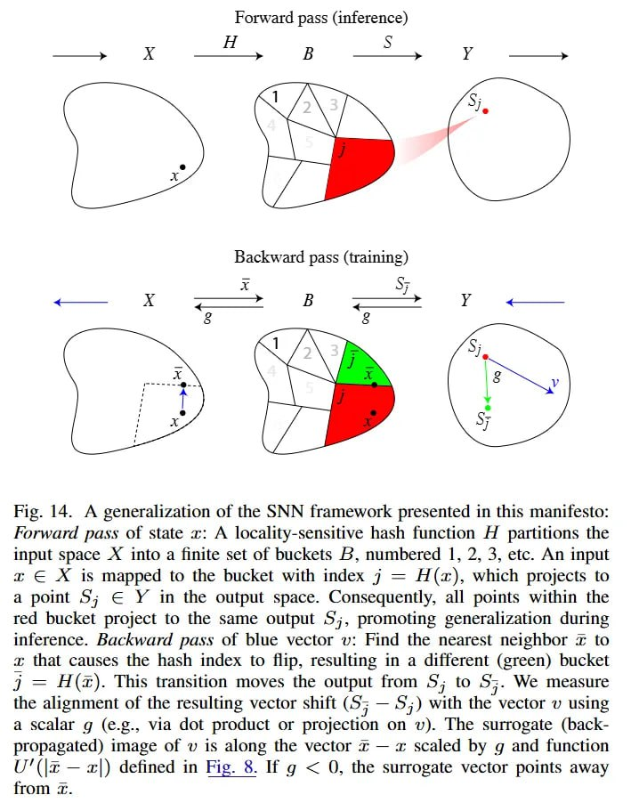

# Image Description

**File:** img_1768120808_aqad4gtrg50feut_fig_14_a_generalization_of_the.jpg
**Original:** image.jpg
**Received:** 1768120808

## Extracted Text (OCR)

Fig. 14. A generalization of the SNN framework presented 1n this manifesto: Forward pass of state г: A locality-sensitive hash function A partitions the input space A into a finite set of buckets 6, numbered 1, 2, 3, etc. An input x € X is mapped to the bucket with index 7 = H(z), which projects to a point 5; Е У in the output space. Consequently, all points within the red bucket project to the same output 5;, promoting generalization during inference. Backward pass of blue vector v: Find the nearest neighbor &lt;x to 1; that causes the hash index to flip, resulting in a different (green) bucket j = Н(2). This transition moves the output from 5; to S53. We measure the alignment of the resulting vector shift (57 —.5;) with the vector v using a scalar д (e.g., via dot product or projection on wv). The surrogate (backpropagated) image of v is along the vector т — x scaled by д and function U"(\a — |) defined in Fig. 8. Ид &lt; O, the surrogate vector points away from 1:

<!-- image -->

## Usage Instructions

When referencing this image in markdown:
1. Use relative path based on file location
2. Add descriptive alt text based on OCR content above
3. Add text description BELOW the image for GitHub rendering

Example:
```markdown
 <!-- TODO: Broken image path -->

**Image shows:** [Describe what the image contains based on OCR]
```
