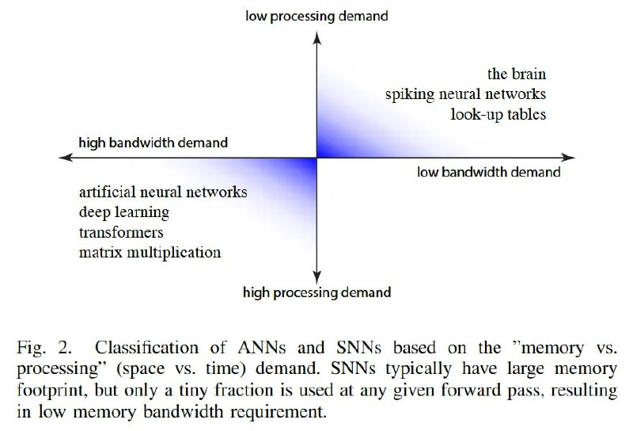

# Image Description

**File:** img_1768120808_aqad4qtrg50feut9_image_fig_2.jpg
**Original:** image.jpg
**Received:** 1768120808

## Extracted Text (OCR)

<!-- image -->

- Fig. 2. Classincation of ANNs and SNNs based on the "memory VS. processing (space vs. time) demand. SNNs typically have large memory footprint, but only a tiny fraction is used at any given forward pass, resulting in low memory bandwidth requirement.

## Usage Instructions

When referencing this image in markdown:
1. Use relative path based on file location
2. Add descriptive alt text based on OCR content above
3. Add text description BELOW the image for GitHub rendering

Example:
```markdown
 <!-- TODO: Broken image path -->

**Image shows:** [Describe what the image contains based on OCR]
```
