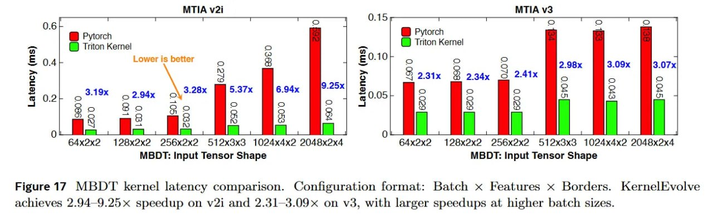

# Image Description

**File:** img_1768120845_aqad0gtrgxe4gut_figure_17_kernel_latency_comparison.jpg
**Original:** image.jpg
**Received:** 1768120845

## Extracted Text (OCR)

Figure 17 МВОТ kernel latency comparison. Configuration format: Batch x Features x Borders. KernelEvolve achieves 2.94—9.25x speedup on v21 and 2.31—3.09 on v3, with larger speedups at higher batch sizes.

<!-- image -->

## Usage Instructions

When referencing this image in markdown:
1. Use relative path based on file location
2. Add descriptive alt text based on OCR content above
3. Add text description BELOW the image for GitHub rendering

Example:
```markdown
 <!-- TODO: Broken image path -->

**Image shows:** [Describe what the image contains based on OCR]
```
