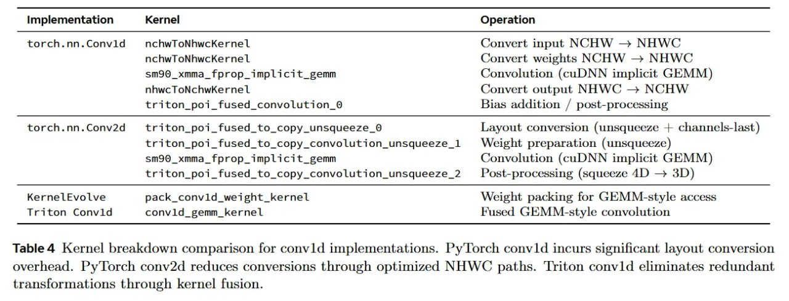

# Image Description

**File:** img_1768120845_aqad0qtrgxe4gut_implementation_kernel_operation.jpg
**Original:** image.jpg
**Received:** 1768120845

## Extracted Text (OCR)

| implementation Kernel Operation                                                                                                                                                                                                                                                                                                       |
|---------------------------------------------------------------------------------------------------------------------------------------------------------------------------------------------------------------------------------------------------------------------------------------------------------------------------------------|
| torch.nn.Convld  nchwToNhwcKernel Convert input NCHW — NHWC nchwToNhwcKernel Convert weights NCHW — NHWC sm9Q_xmma_fprop_implicit_gemm Convolution (cuDNN implicit GEMM) nhwcToNchwKernel Convert output NHWC > NCHW triton_poi_fused_convolution_9 Bias addition / post-processing                                                   |
| torch.nn.Conv2d triton_poi_fused_to_copy_unsqueeze_0 Layout conversion (unsqueeze + channels-last) triton_poi_fused_to_copy_convolution_unsqueeze_1 Weight preparation (unsqueeze) sm90_xmma_fprop_implicit_gemm Convolution (cuDNN implicit GEMM) triton_poi_fused_to_copy_convolution_unsqueeze_2 Post-processing (squeeze 4D — 3D) |
| KerneLlEvolve pack_convld_weight_kernel Weight packing for GEMM-style access Triton Convid convld_gemm_kernel Fused GEMM-style convolution                                                                                                                                                                                            |

Table 4 Kernel breakdown comparison for convld implementations. Py'Torch convld incurs significant layout conversion overhead. Py'Torch conv2d reduces conversions through optimized NHWC paths. 'Triton convld eliminates redundant transformations through kernel fusion.

## Usage Instructions

When referencing this image in markdown:
1. Use relative path based on file location
2. Add descriptive alt text based on OCR content above
3. Add text description BELOW the image for GitHub rendering

Example:
```markdown
 <!-- TODO: Broken image path -->

**Image shows:** [Describe what the image contains based on OCR]
```
