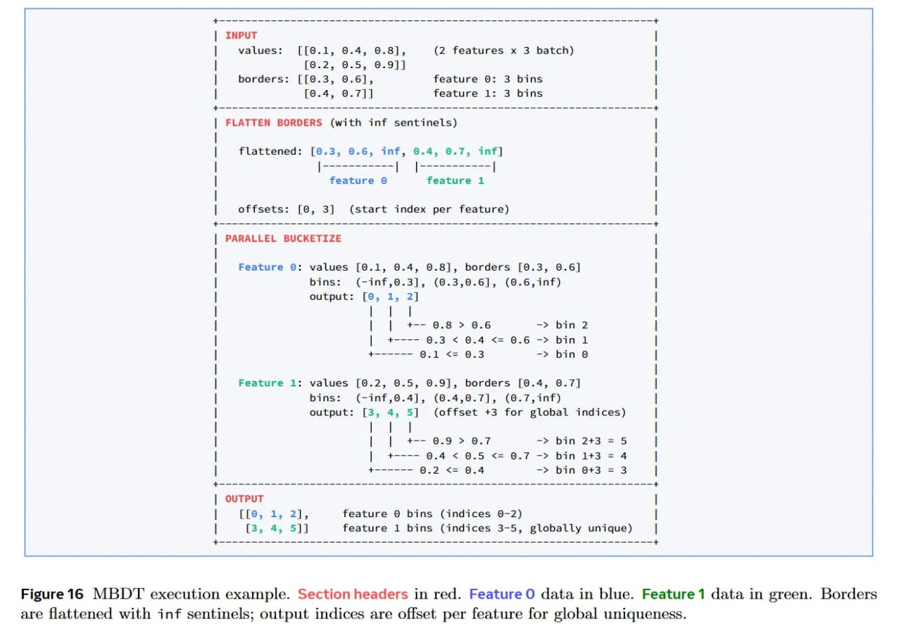

# Image Description

**File:** img_1768120845_aqad0wtrgxe4gut_figure16_mbd_t_execution_example_section.jpg
**Original:** image.jpg
**Received:** 1768120845

## Extracted Text (OCR)

Figure16 MBD'T execution example. Section headers in red. Feature О data in blue. Feature1 data in green. Borders are flattened with inf sentinels; output indices are offset per feature for global uniqueness.

<!-- image -->

## Usage Instructions

When referencing this image in markdown:
1. Use relative path based on file location
2. Add descriptive alt text based on OCR content above
3. Add text description BELOW the image for GitHub rendering

Example:
```markdown
 <!-- TODO: Broken image path -->

**Image shows:** [Describe what the image contains based on OCR]
```
