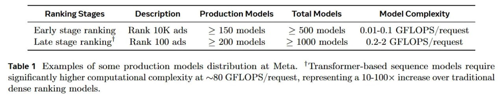

# Image Description

**File:** img_1768120845_aqadxatrgxe4gut_ranking_stages_description_production_mo.jpg
**Original:** image.jpg
**Received:** 1768120845

## Extracted Text (OCR)

| Ranking Stages Description Production Models Total Models Model Complexity   |                                                                                                                                                                       |
|------------------------------------------------------------------------------|-----------------------------------------------------------------------------------------------------------------------------------------------------------------------|
|                                                                              | Early stage ranking Rank LOK ads > 150 models > 500 models  0.01-0.1 GFLOPS/request Late stage ranking’ Rank 100 ads > 200 models > 1000 models 0.2-2 GFLOPS /request |

Table 1 Examples of some production models distribution at Meta. 'Transformer-based sequence models require significantly higher computational complexity at ~80 GFLOPS/request, representing a 10-100 increase over traditional dense ranking models.

## Usage Instructions

When referencing this image in markdown:
1. Use relative path based on file location
2. Add descriptive alt text based on OCR content above
3. Add text description BELOW the image for GitHub rendering

Example:
```markdown
 <!-- TODO: Broken image path -->

**Image shows:** [Describe what the image contains based on OCR]
```
