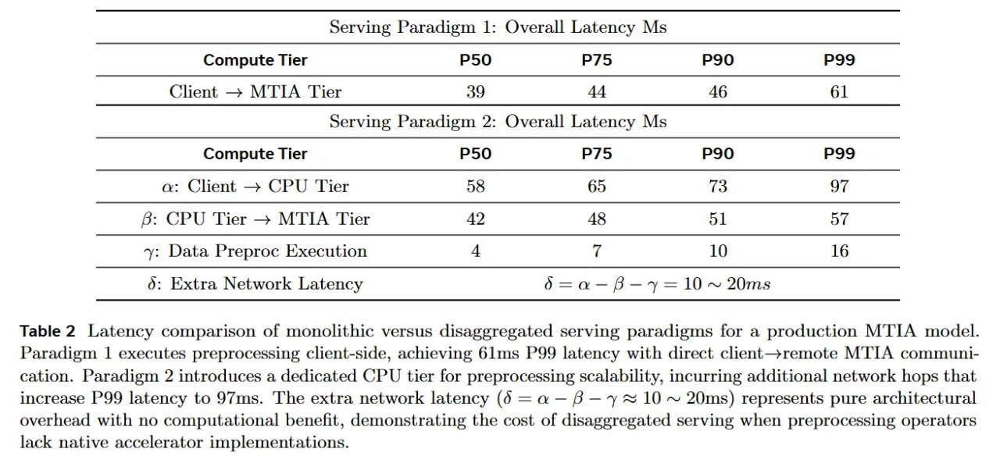

# Image Description

**File:** img_1768120845_aqadxqtrgxe4gut_serving_paradigm_1_overall_latency.jpg
**Original:** image.jpg
**Received:** 1768120845

## Extracted Text (OCR)

| Serving Paradigm 1: Overall Latency Ms   | Serving Paradigm 1: Overall Latency Ms     | Serving Paradigm 1: Overall Latency Ms     | Serving Paradigm 1: Overall Latency Ms     | Serving Paradigm 1: Overall Latency Ms   |
|------------------------------------------|--------------------------------------------|--------------------------------------------|--------------------------------------------|------------------------------------------|
| Compute lier P50 P/5 P90 P99             |                                            |                                            |                                            |                                          |
| (‘hent — МТТА ‘Tier  A                   |                                            |                                            |                                            |                                          |
| serving Paradigm 2: Overall Latency Ms   | serving Paradigm 2: Overall Latency Ms     | serving Paradigm 2: Overall Latency Ms     | serving Paradigm 2: Overall Latency Ms     | serving Paradigm 2: Overall Latency Ms   |
| Compute lier P50 P/S P90 P99             |                                            |                                            |                                            |                                          |
| (yy:  Chent — CPU Tier  58  65  73  97   |                                            |                                            |                                            |                                          |
| В: CPU Tier — MTIA Tier  42  51  57      |                                            |                                            |                                            |                                          |
| y: Data Preproc Execution  10  16        |                                            |                                            |                                            |                                          |
|                                          | 0; Extra Network Latency dé=a-P-y=10~ 20ms | 0; Extra Network Latency dé=a-P-y=10~ 20ms | 0; Extra Network Latency dé=a-P-y=10~ 20ms |                                          |

Table 2 Latency comparison of monolithic versus disaggregated serving paradigms for a production MTIA model. Paradigm | executes preprocessing client-side, achieving 61ms P99 latency with direct chent—remote МТТА communtication. Paradigm 2 introduces a dedicated CPU tier for preprocessing scalability, incurring additional network hops that increase P99 latency to 97ms. The extra network latency (6 = a — 8 —~y + 10 ~ 20ms) represents pure architectural overhead with no computational benefit, demonstrating the cost of disaggregated serving when preprocessing operators lack native accelerator implementations.

## Usage Instructions

When referencing this image in markdown:
1. Use relative path based on file location
2. Add descriptive alt text based on OCR content above
3. Add text description BELOW the image for GitHub rendering

Example:
```markdown
 <!-- TODO: Broken image path -->

**Image shows:** [Describe what the image contains based on OCR]
```
