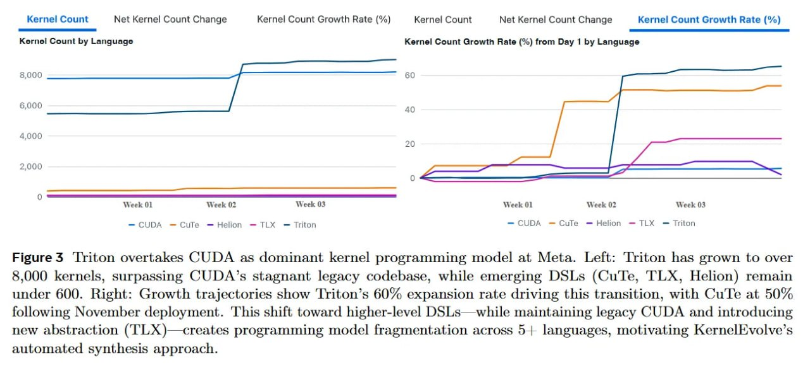

# Image Description

**File:** img_1768120845_aqadxwtrgxe4gut_figure_3_overtakes_cuda_as.jpg
**Original:** image.jpg
**Received:** 1768120845

## Extracted Text (OCR)

Figure 3 Ттцоп overtakes CUDA as dominant kernel programming model at Meta. Left: Triton has grown to over 8,000 kernels, surpassing CUDA's stagnant legacy codebase, while emerging DSLs (CuTe, TLX, Helion) remain under 600. Right: Growth trajectories show Triton's 60% expansion rate driving this transition, with CuTe at 50% following November deployment. 'This shift toward higher-level DSLs—while maintaining legacy CUDA and introducing new abstraction (TLX)—creates programming model fragmentation across 5! languages, motivating KernelEvolve's automated synthesis approach.

<!-- image -->

## Usage Instructions

When referencing this image in markdown:
1. Use relative path based on file location
2. Add descriptive alt text based on OCR content above
3. Add text description BELOW the image for GitHub rendering

Example:
```markdown
 <!-- TODO: Broken image path -->

**Image shows:** [Describe what the image contains based on OCR]
```
