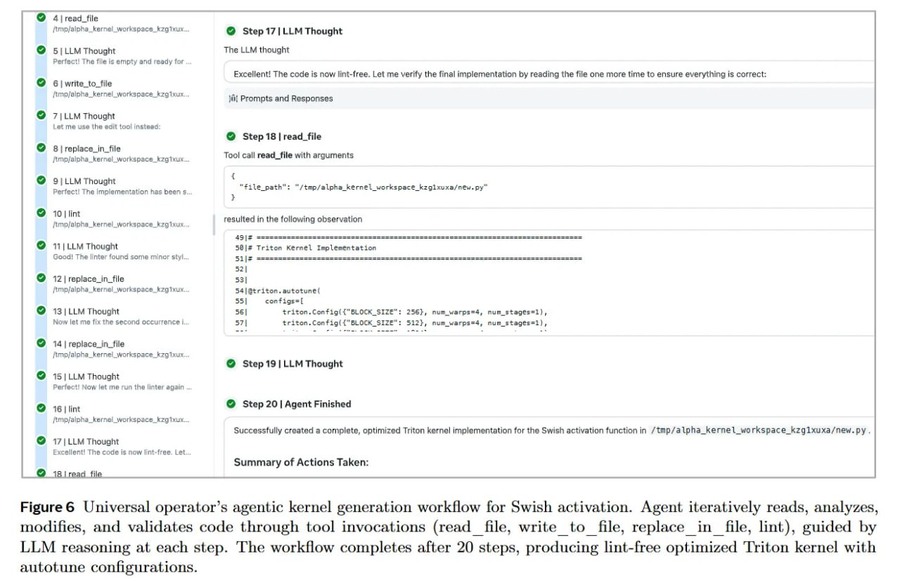

# Image Description

**File:** img_1768120845_aqadygtrgxe4gut_figure_6_universal_operator_s_agentic_ke.jpg
**Original:** image.jpg
**Received:** 1768120845

## Extracted Text (OCR)

Figure 6 Universal operator's agentic kernel generation workflow for Swish activation. Agent iteratively reads, analyzes, modifies, and validates code through tool invocations (read file, write to file, replace in file, lint), guided by LLM reasoning at each step. The workflow completes after 20 steps, producing lint-free optimized 'Triton kernel with autotune configurations.

<!-- image -->

## Usage Instructions

When referencing this image in markdown:
1. Use relative path based on file location
2. Add descriptive alt text based on OCR content above
3. Add text description BELOW the image for GitHub rendering

Example:
```markdown
 <!-- TODO: Broken image path -->

**Image shows:** [Describe what the image contains based on OCR]
```
