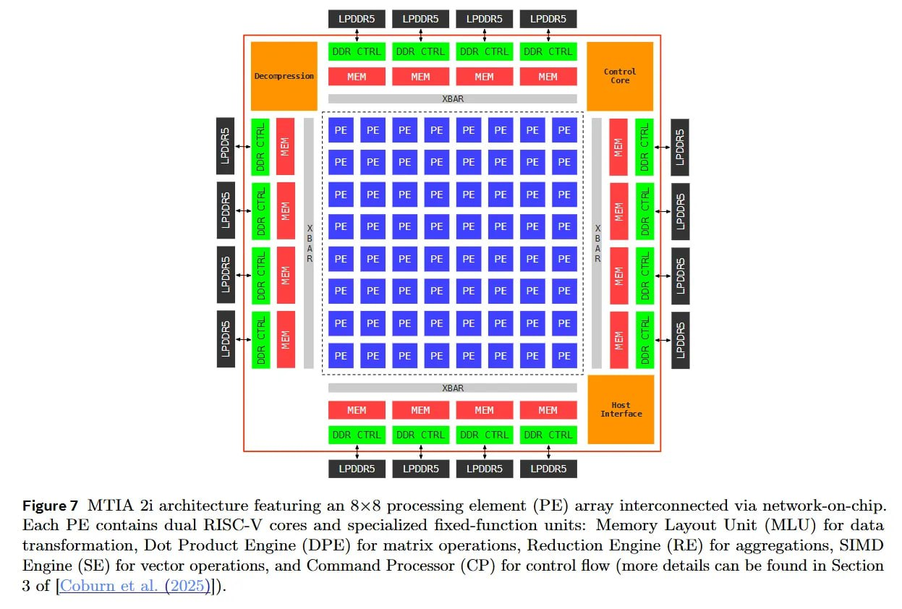

# Image Description

**File:** img_1768120845_aqadzatrgxe4gut_figure7_21_architecture_featuring_an.jpg
**Original:** image.jpg
**Received:** 1768120845

## Extracted Text (OCR)

Figure7 МТТА 21 architecture featuring an 8х8 processing element (PE) array interconnected via network-on-chip. Each PE contains dual RISC-V cores and specialized fixed-function units: Memory Layout Unit (MLU) for data transformation, Dot Product Engine (DPI) for matrix operations, Reduction Engine (RE) for aggregations, SIMD прое (516) for vector operations, and Command Processor (CP) for control How (more details can be found in Section 3 of [Coburn et al. (2025)}).

<!-- image -->

## Usage Instructions

When referencing this image in markdown:
1. Use relative path based on file location
2. Add descriptive alt text based on OCR content above
3. Add text description BELOW the image for GitHub rendering

Example:
```markdown
 <!-- TODO: Broken image path -->

**Image shows:** [Describe what the image contains based on OCR]
```
