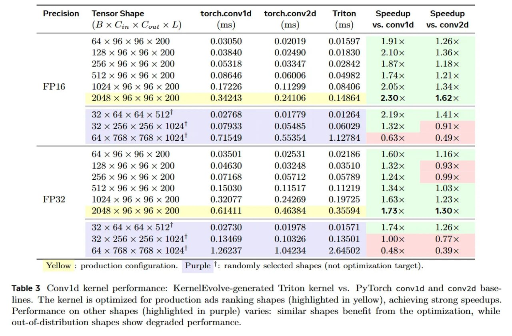

# Image Description

**File:** img_1768120845_aqadzgtrgxe4gut_precision_tensor_shape_torch_convid_torc.jpg
**Original:** image.jpg
**Received:** 1768120845

## Extracted Text (OCR)

| Precision tensor Shape torch.convid  torch.conv2d Triton Speedup Speedup (B® Can х Geet SD) (ms) (ms) (ms) vs. convid = vs. conv2d   |
|--------------------------------------------------------------------------------------------------------------------------------------|
| Ho4 «x G  6b x 9  вм POO  030  50  0.02019  ().O0L597  1L9°l~x                                                                       |
| 125 х 96 х 96 х 200  0.02490                                                                                                         |
| 256 х об «x 96 х 200  005313                                                                                                         |
| FP16 1024 x 96 x 96 x 200 0.17226 0.11299 0.08406 9 05x 1.34~x                                                                       |
| 2048 x 96 x 96 x 200 0.54243 0.24106 0.14864 27.50 1.62                                                                              |
| 39 х 64 x 64 x 512! 0.02768 0.01779 0.01264 2 19x 1.4] x                                                                             |
| 39 х 256 «x 256 x 10241 0.07933 0.05485 0.06029 1 S32 sc 0.9]х                                                                       |
| 64 x 768 x 768 x 10241 0.71549 0.55354 1.19784 0.63 x 0.49                                                                           |
| 64 « 96  * Oo  6 «x 200  0.03501  0253]  0.02? 186  1.60%  1.]6х                                                                     |
| LPR x 96 x 96 «x POO  ОА  630  0.03248  0.03510  Loox                                                                                |
| 256 х 96 х 96 х 200                                                                                                                  |
| P32? 1024 x 96 x 96 x 200 0.32077 0.24269 0.19725 1.63x 1.23х                                                                        |
| 2OUAS  х 96 х 96 х ZOO  0.61411  ().46  35  0.359594  1.735%  1.40 x                                                                 |
| 29 х 64 х G64 x 5197 002730 0.01978 0.01571 1 74Ах 126х                                                                              |
| 39 х 256 х 256 x 10241 0.13469 0.10326 0.13501 1.00х 0.77                                                                            |
| 64 x 768 x 768 x 10241 1.26237 1.04234 2.64502 0.48 « 0.39                                                                           |

Yellow : production configuration. Purple ': randomly selected shapes (not optimization target).

Table $ Convlid kernel performance: Kernel volve-generated 'Triton kernel vs. Py Torch convld and conv2d baselines. The kernel is optimized for production ads ranking shapes (highlighted in yellow), achieving strong speedups. Performance on other shapes (highlighted in purple) varies: similar shapes benefit from the optimization, while out-ol-distribution shapes show degraded performance.

## Usage Instructions

When referencing this image in markdown:
1. Use relative path based on file location
2. Add descriptive alt text based on OCR content above
3. Add text description BELOW the image for GitHub rendering

Example:
```markdown
 <!-- TODO: Broken image path -->

**Image shows:** [Describe what the image contains based on OCR]
```
