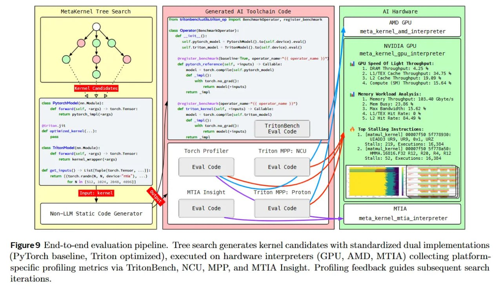

# Image Description

**File:** img_1768120845_aqadzqtrgxe4gut_figure9_eind_to_end_evaluation_pipeline_.jpg
**Original:** image.jpg
**Received:** 1768120845

## Extracted Text (OCR)

Figure9 Eind-to-end evaluation pipeline. 'Tree search generates kernel candidates with standardized dual implementations (Py'Torch baseline, 'Triton optimized), executed on hardware interpreters (GPU, AMD, MTIA) collecting platformspecific profiling metrics via '[ritonBench, NCU, MPP, and MTIA Insight. Prohiling feedback guides subsequent search iterations.

<!-- image -->

## Usage Instructions

When referencing this image in markdown:
1. Use relative path based on file location
2. Add descriptive alt text based on OCR content above
3. Add text description BELOW the image for GitHub rendering

Example:
```markdown
 <!-- TODO: Broken image path -->

**Image shows:** [Describe what the image contains based on OCR]
```
