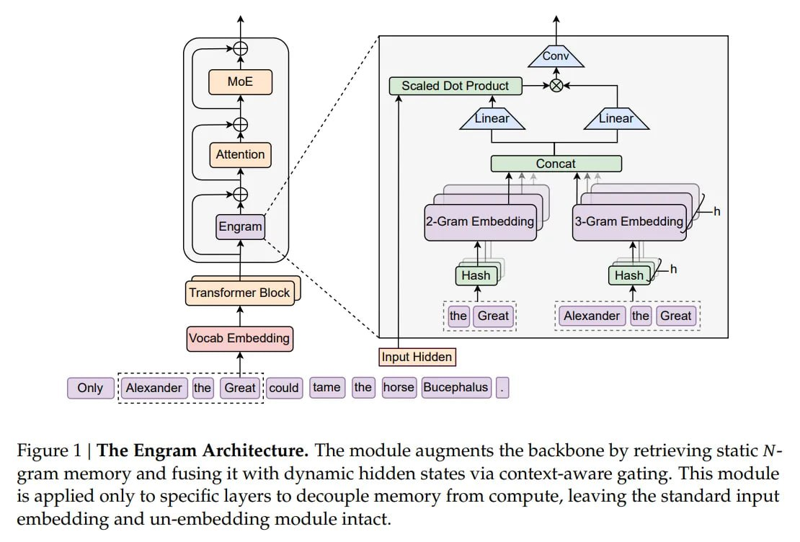

# Image Description

**File:** img_1768272674_aqad1w1rg6qmut_figure_1_the_engram_architecture.jpg
**Original:** image.jpg
**Received:** 1768272674

## Extracted Text (OCR)

Figure 1 | The Engram Architecture. [пе module augments the backbone by retrieving static Ngtam memory and fusing it with dynamic hidden states via context-aware gating. This module is applied only to specific layers to decouple memory from compute, leaving the standard input embedding and un-embedding module intact.

<!-- image -->

## Usage Instructions

When referencing this image in markdown:
1. Use relative path based on file location
2. Add descriptive alt text based on OCR content above
3. Add text description BELOW the image for GitHub rendering

Example:
```markdown
 <!-- TODO: Broken image path -->

**Image shows:** [Describe what the image contains based on OCR]
```
