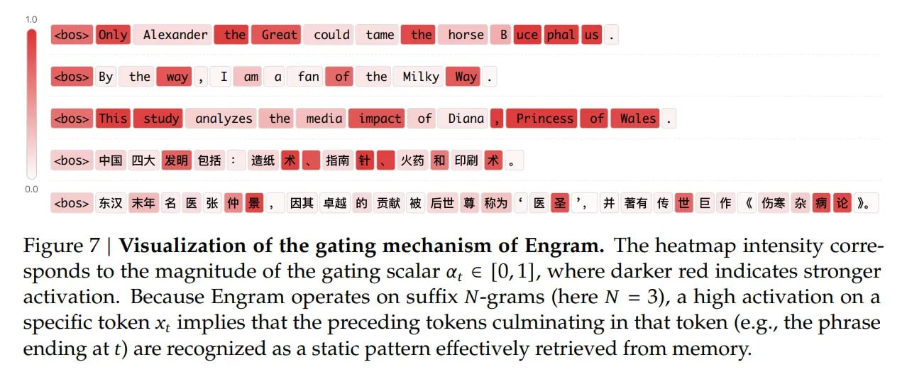

# Image Description

**File:** img_1768272674_aqad2a1rg6qmut_image_figure_7.jpg
**Original:** image.jpg
**Received:** 1768272674

## Extracted Text (OCR)

<!-- image -->

Figure 7 | Visualization of the gating mechanism of Engram. The heatmap intensity corresponds to the magnitude of the gating scalar a, Е |0,1|, where darker red indicates stronger activation. Because Engram operates on suffix N-grams (here N = 3), a high activation on a specific token x, implies that the preceding tokens culminating in that token (e.g., the phrase ending at t) are recognized as a static pattern effectively retrieved from memory.

## Usage Instructions

When referencing this image in markdown:
1. Use relative path based on file location
2. Add descriptive alt text based on OCR content above
3. Add text description BELOW the image for GitHub rendering

Example:
```markdown
 <!-- TODO: Broken image path -->

**Image shows:** [Describe what the image contains based on OCR]
```
