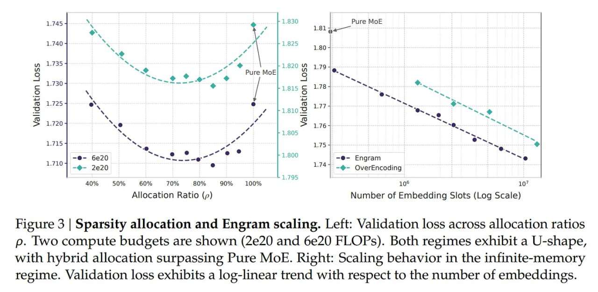

# Image Description

**File:** img_1768272674_aqad2g1rg6qmut_figure_3_sparsity_allocation_and.jpg
**Original:** image.jpg
**Received:** 1768272674

## Extracted Text (OCR)

Figure 3 | Sparsity allocation and Engram scaling. Left: Validation loss across allocation ratios p. lwo compute budgets are shown (2e20 and 6e20 FLOPs). Both regimes exhibit a U-shape, with hybrid allocation surpassing Pure MoE. Right: Scaling behavior in the infinite-memory regime. Validation loss exhibits a log-linear trend with respect to the number of embeddings.

<!-- image -->

## Usage Instructions

When referencing this image in markdown:
1. Use relative path based on file location
2. Add descriptive alt text based on OCR content above
3. Add text description BELOW the image for GitHub rendering

Example:
```markdown
 <!-- TODO: Broken image path -->

**Image shows:** [Describe what the image contains based on OCR]
```
