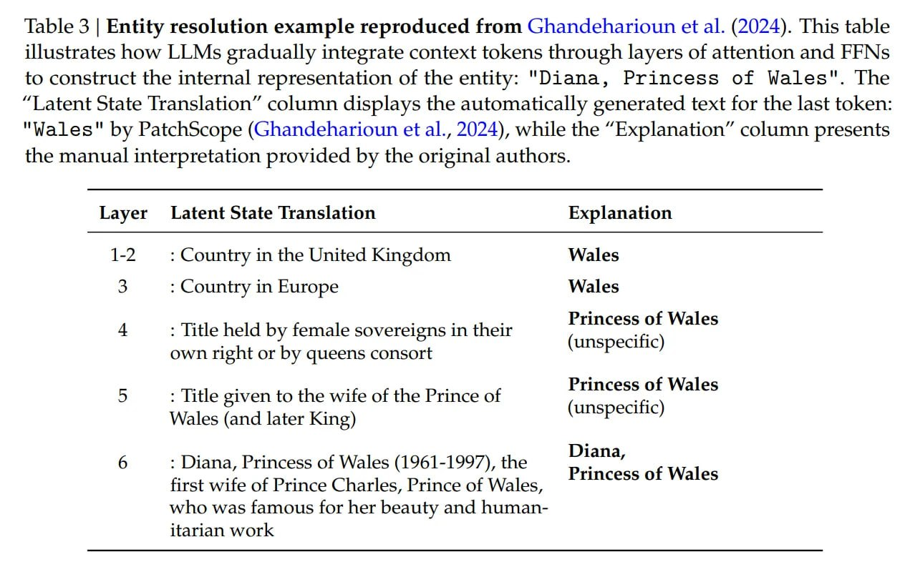

# Image Description

**File:** img_1768272674_aqad2q1rg6qmut_table_3_entity_resolution_example.jpg
**Original:** image.jpg
**Received:** 1768272674

## Extracted Text (OCR)

Table 3 | Entity resolution example reproduced from Ghandeharioun et al. (2024). This table illustrates how LLMs gradually integrate context tokens through layers of attention and FFNs to construct the internal representation of the entity: "Diana, Princess of Wales". The "Latent State Translation" column displays the automatically generated text for the last token: "Wales" by PatchScope (Ghandeharioun et al., 2024), while the "Explanation" column presents the manual interpretation provided by the original authors.

| Layer Latent State Translation Explanation                                                                                                                                        |
|-----------------------------------------------------------------------------------------------------------------------------------------------------------------------------------|
| 1-2  : Country in the United Kingdom  Wales                                                                                                                                       |
| 3  : Country in Europe  Wales                                                                                                                                                     |
| Princess of Wales — ee eee ee —  4 : litle held by female sovereigns in their  = re TL TSE ee: a on 4 : ee ee ee ee own right or by queens consort                                |
| Princess ot Wales = — ee ee ee —  2) : litle given to the wife of the Prince of с. ТА ЦЩ_ г _ ТЕТ" _ А (unspecific) Wales (and later King)                                        |
| : Diana, Princess of Wales (1961-1997), the =— ще a м = южные fF — г  fest уве оЁ Prince Charles, Prince of Wales, EEE VERE who was famous for her beauty and human- itarian work |

## Usage Instructions

When referencing this image in markdown:
1. Use relative path based on file location
2. Add descriptive alt text based on OCR content above
3. Add text description BELOW the image for GitHub rendering

Example:
```markdown
 <!-- TODO: Broken image path -->

**Image shows:** [Describe what the image contains based on OCR]
```
