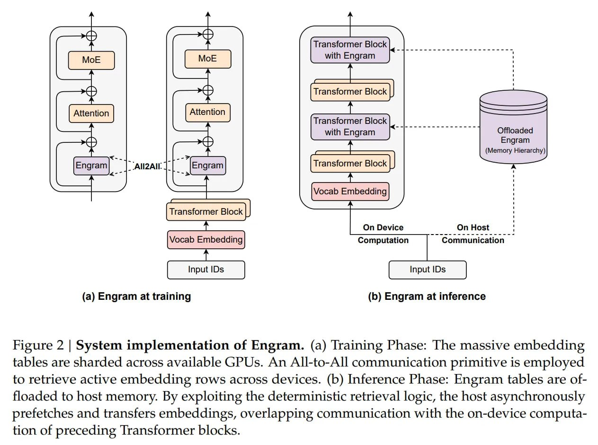

# Image Description

**File:** img_1768272674_aqad2w1rg6qmut_figure_2_system_implementation_of.jpg
**Original:** image.jpg
**Received:** 1768272674

## Extracted Text (OCR)

Figure 2 | System implementation of Engram. (a) [raining Phase: The massive embedding tables are sharded across available GPUs. An All-to-All communication primitive is employed to retrieve active embedding rows across devices. (b) Inference Phase: Engram tables are offloaded to host memory. By exploiting the deterministic retrieval logic, the host asynchronously prefetches and transfers embeddings, overlapping communication with the on-device computation of preceding Transformer blocks.

<!-- image -->

## Usage Instructions

When referencing this image in markdown:
1. Use relative path based on file location
2. Add descriptive alt text based on OCR content above
3. Add text description BELOW the image for GitHub rendering

Example:
```markdown
 <!-- TODO: Broken image path -->

**Image shows:** [Describe what the image contains based on OCR]
```
