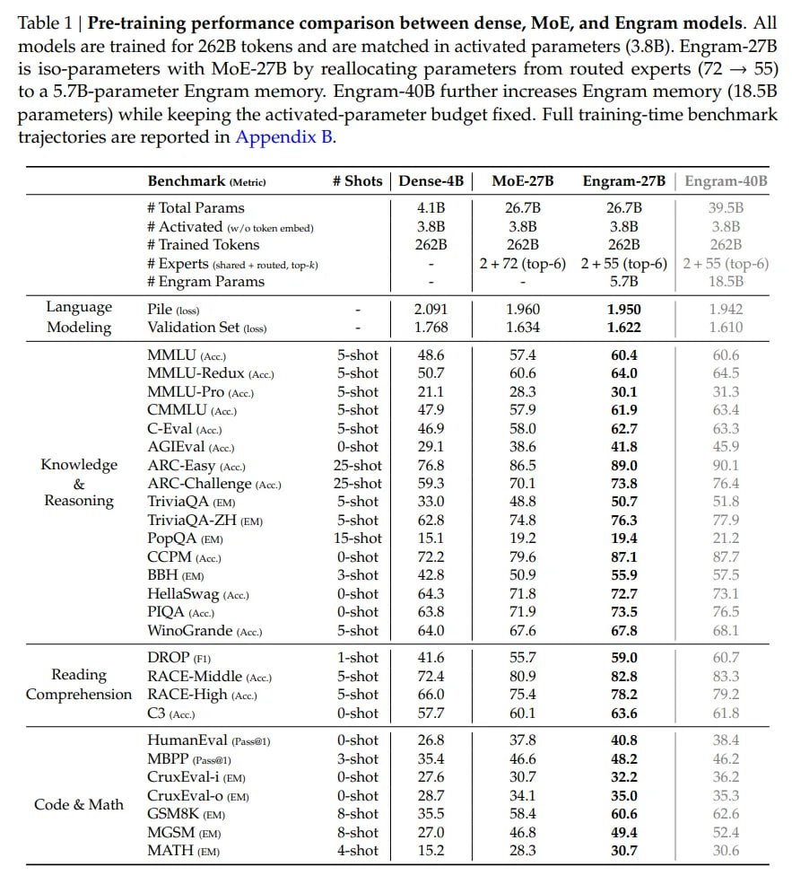

# Image Description

**File:** img_1768272674_aqad3a1rg6qmut_table_1_pre_training_performance_compari.jpg
**Original:** image.jpg
**Received:** 1768272674

## Extracted Text (OCR)

Table 1 | Pre-training performance comparison between dense, MoE, and Engram models. All models are trained for 262B tokens and are matched in activated parameters (3.8B). Engram-27B is iso-parameters with MoE-27B by reallocating parameters from routed experts (72 — 55) to a 5.7/B-parameter Engram memory. Engram-40B further increases Engram memory (18.5B parameters) while keeping the activated-parameter budget fixed. Full training-time benchmark trajectories are reported in Appendix B.

| Benchmark (Metric) # Shots | Dense-4B | МоЕ-27В — Епртат-27В — Engram-40B                                                                                                                        |
|--------------------------------------------------------------------------------------------------------------------------------------------------------------------------------------------------|
| # Activated сл го token embed)  3.88  3.80  3.38 # [та lokens | В | IA2B 2626 УСН # Experts (shared + routed, top-k) - | 2+/2(top-6) 2+55 (top-6) | 2+ 55 (top-6) # Engram Params - - 3./B 16.55 |
| Language Pile (toss) - | per | 1.960 1.950 1.942                                                                                                                                                 |
| Modeling Validation Set (loss) - | 1.58 | 1.634 1.622 L.610}                                                                                                                                     |
| ММ (Acc) S-shot | 48.6 | 5/4 60.4 60.6                                                                                                                                                           |
| АМ -кевацих (Acc)  S-shot |  S07  60.6  64.0  G45                                                                                                                                                |
| MIMULLU-Pro (Acc)  S-shot |  211  20.5  30.1                                                                                                                                                     |
| L ( Acc.)  S-snot |  4/9  5/9  61.9  65.4                                                                                                                                                        |
| ( -EVal (Acc)  S-shot |  46.9  58.0  62.7                                                                                                                                                        |
| A(GslEVal (Асс U-shot | 291 | 38.6 41.8 45.9                                                                                                                                                     |
| Knowledge ARC-Easy (Acc) 25-shot | 768 | 86.5 89.0 чи. |                                                                                                                                         |
| AKC-Challenge (Acc) 25-shot | 59.3 | #0.1 73.8 /bo4                                                                                                                                              |
| Reasoning  TriviaQ A (EM)  5-shot |  33.0  48.8  50.7  И                                                                                                                                         |
| Тела А-П (EM)  4-shot |  62.5  /4.8  76.3  i 4                                                                                                                                                   |
| PopQa (EM)  15-shot |  15.1  19.2  19.4  21.2                                                                                                                                                    |
| СС РМ (Acc. U-shot | #2. | 9.6 87.1                                                                                                                                                              |
| bb (EM) S-shnot | 47.5 | 50.9 55.9                                                                                                                                                               |
| Mellaswag (Acc.)  U-shot |  64.35  1.5  72.7                                                                                                                                                     |
| PICA (Acc)  U-shot |  63.5  “/L9  73.5                                                                                                                                                           |
| Winolsrande (Acc) S-snot | 64.0 | 6/6 67.5 68.1]                                                                                                                                                 |
| DROP (Fi)  l-shot |  41.6  ie ae  59.0                                                                                                                                                           |
| Reading  5-shot |  72.4  80.9  82.8                                                                                                                                                              |
| Comprehension RKACE-Fi  igh (Acc.)  S-shot |  66.0  15.4  78.2  /9.2                                                                                                                             |
| (3 (Acc)  U-shot |  БИ  60.1  63.6                                                                                                                                                               |
| Humane val (Passa)  Q-shot |  26.5  3/4                                                                                                                                                          |
| MIBPP газа)  3-shot |  35.4  46.6  48.2  46.2                                                                                                                                                    |
| ( ruxEvVal-1 (EM)  U-shot |  2/.6  a0  32.2.                                                                                                                                                     |
| ( ruxEval-o (EM)  U-shot |  28./  35.0                                                                                                                                                           |
| Code & Ма смак cen 8-shot | 355 58.4 60.6 62.6                                                                                                                                                   |
| MIC sSML CEM)  S-shot |  2 A  49,4                                                                                                                                                               |
| МАГН (EM) 4-shot | 15.2 | 2o.0 30.7  ALG                                                                                                                                                         |

## Usage Instructions

When referencing this image in markdown:
1. Use relative path based on file location
2. Add descriptive alt text based on OCR content above
3. Add text description BELOW the image for GitHub rendering

Example:
```markdown
 <!-- TODO: Broken image path -->

**Image shows:** [Describe what the image contains based on OCR]
```
