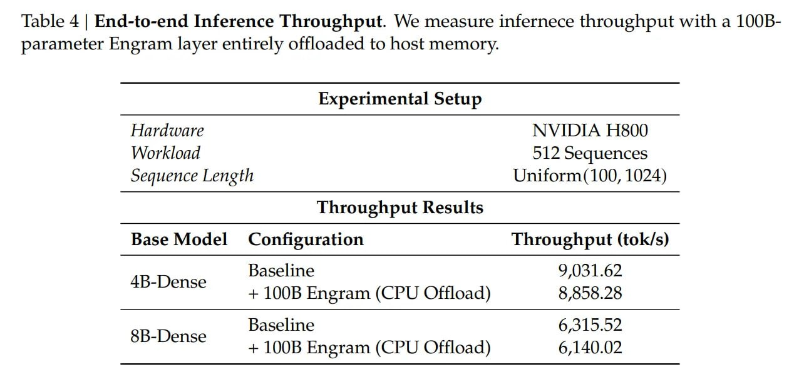

# Image Description

**File:** img_1768272674_aqad3g1rg6qmut_table_4_end_to_end_inference_throughput.jpg
**Original:** image.jpg
**Received:** 1768272674

## Extracted Text (OCR)

Table 4 | End-to-end Inference Throughput. We measure infernece throughput with a 100Вparameter Engram layer entirely offloaded to host memory.

| Experimental Setup                                                             | Experimental Setup                                                                                                        | Experimental Setup   |
|--------------------------------------------------------------------------------|---------------------------------------------------------------------------------------------------------------------------|----------------------|
| Hardware NVIDIA H&00 Workloaa 512 Sequences Sequence Length Uniform(100, 1024) | Hardware NVIDIA H&00 Workloaa 512 Sequences Sequence Length Uniform(100, 1024)                                            |                      |
| Throughput Results                                                             | Throughput Results                                                                                                        | Throughput Results   |
|                                                                                | Base Model Configuration Throughput (tok/s)                                                                               |                      |
|                                                                                | AB-Dense  Baseline 9 031.62  са — — = -=—=ы: г ет щ— = — и Ри | к Ш ® a ~~ = = — eee’. 100B Engram (CPU Offload) 8,858.28 |                      |
|                                                                                | 8B-Dense  Baseline 6,315.52  а — — = oC г == = т 2=>Н = El с Ш“ - | » р + 100B Engram (CPU Offload) 6,140.02              |                      |

## Usage Instructions

When referencing this image in markdown:
1. Use relative path based on file location
2. Add descriptive alt text based on OCR content above
3. Add text description BELOW the image for GitHub rendering

Example:
```markdown
 <!-- TODO: Broken image path -->

**Image shows:** [Describe what the image contains based on OCR]
```
