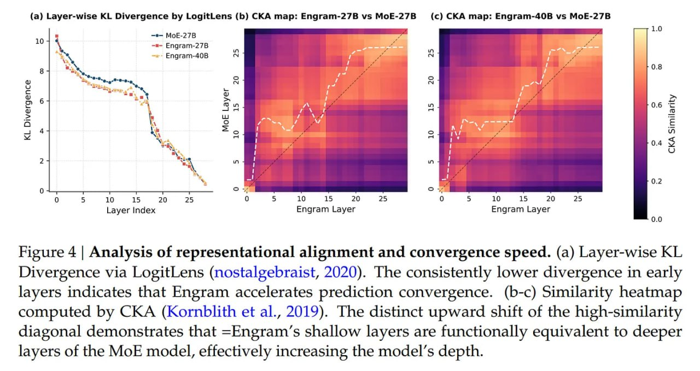

# Image Description

**File:** img_1768272674_aqad3w1rg6qmut_figure_4_analysis_of_representational.jpg
**Original:** image.jpg
**Received:** 1768272674

## Extracted Text (OCR)

Figure 4 | Analysis of representational alignment and convergence speed. (a) Layer-wise KL Divergence via LogitLens (nostalgebraist, 2020). The consistently lower divergence in early layers indicates that Engram accelerates prediction convergence. (b-c) Similarity heatmap computed by СКА (Kornblith et al., 2019). The distinct upward shift of the high-similarity diagonal demonstrates that =Engram's shallow layers are functionally equivalent to deeper layers of the MoE model, effectively increasing the model's depth.

<!-- image -->

## Usage Instructions

When referencing this image in markdown:
1. Use relative path based on file location
2. Add descriptive alt text based on OCR content above
3. Add text description BELOW the image for GitHub rendering

Example:
```markdown
 <!-- TODO: Broken image path -->

**Image shows:** [Describe what the image contains based on OCR]
```
