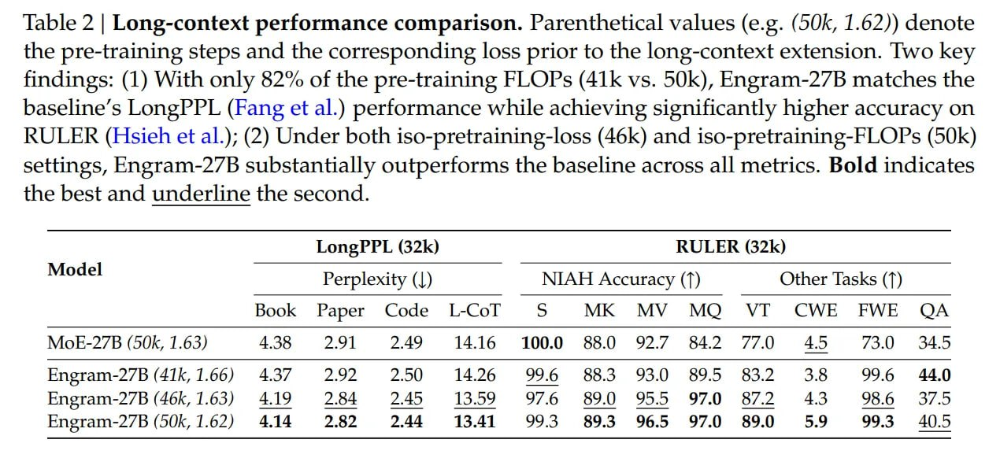

# Image Description

**File:** img_1768272674_aqad4a1rg6qmut_table_2_long_context_performance_compari.jpg
**Original:** image.jpg
**Received:** 1768272674

## Extracted Text (OCR)

Table 2 | Long-context performance comparison. Parenthetical values (e.g. (50k, 1.62)) denote the pre-training steps and the corresponding loss prior to the long-context extension. Two key findings: (1) With only 82% of the pre-training FLOPs (41k vs. 50k), Engram-27B matches the baseline's LongPPL (Fang et al.) performance while achieving significantly higher accuracy on RULER (Hsieh et al.); (2) Under both iso-pretraining-loss (46k) and iso-pretraining-FLOPs (50k) settings, Engram-27B substantially outperforms the baseline across all metrics. Bold indicates the best and underline the second.

| LongPPL (32k) RULER (32k)                              | LongPPL (32k) RULER (32k)                                                    | LongPPL (32k) RULER (32k)                                                        | LongPPL (32k) RULER (32k)                                                   |
|--------------------------------------------------------|------------------------------------------------------------------------------|----------------------------------------------------------------------------------|-----------------------------------------------------------------------------|
| Model Perplexity (|) NIAH Accuracy (7) Other Tasks (Т) | Model Perplexity (|) NIAH Accuracy (7) Other Tasks (Т)                       | Model Perplexity (|) NIAH Accuracy (7) Other Tasks (Т)                           | Model Perplexity (|) NIAH Accuracy (7) Other Tasks (Т)                      |
|                                                        |                                                                              |                                                                                  | Book Paper Code L-Col 5 МК MV MQ УГ CWE FEFWE                               |
|                                                        | MoE-27B (50k, 1.63) 438 291 249 £14.16 100.0 88.0 92.7 842 770 4.5 73.0 34.5 |                                                                                  |                                                                             |
|                                                        |                                                                              | Engram-27B (41k, 1.66) 437 2.92 2.50 14.26 996 883 93.0 89.5 83.2 3.8 99.6 44.0  |                                                                             |
|                                                        |                                                                              |                                                                                  | Engram-27B (46k, 1.63) 419 284 245 1359 976 89.0 95.5 97.0 87.2 43 986 37.5 |
|                                                        |                                                                              | Engram-2/7B (50k, 1.62) 4.14 282 244 1341 9935 89.3 96.5 97.0 89.0 5.9 99.3 40.5 |                                                                             |

## Usage Instructions

When referencing this image in markdown:
1. Use relative path based on file location
2. Add descriptive alt text based on OCR content above
3. Add text description BELOW the image for GitHub rendering

Example:
```markdown
 <!-- TODO: Broken image path -->

**Image shows:** [Describe what the image contains based on OCR]
```
