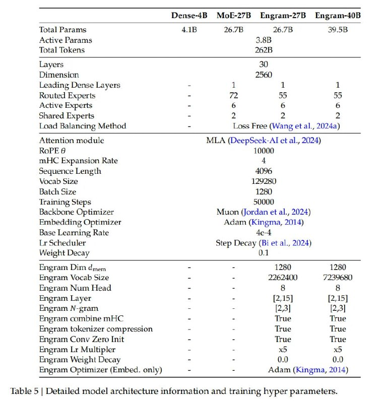

# Image Description

**File:** img_1768272674_aqad4q1rg6qmut9_table_5_detailed_model_architecture.jpg
**Original:** image.jpg
**Received:** 1768272674

## Extracted Text (OCR)

Table 5 | Detailed model architecture information and training hyper parameters.

|                                           | Dense-4B Mobk-276 Engram-2765 Engram-406               |                                                        |                                                        |
|-------------------------------------------|--------------------------------------------------------|--------------------------------------------------------|--------------------------------------------------------|
| Total Params  4 1B  76./6                 |                                                        |                                                        |                                                        |
| Active Params  3.86                       |                                                        |                                                        |                                                        |
| Total Tokens                              |                                                        |                                                        |                                                        |
|                                           | Layers                                                 |                                                        |                                                        |
|                                           | | amension                                             |                                                        |                                                        |
| Leading Dense Layers                      |                                                        |                                                        |                                                        |
| Routed Experts                            |                                                        |                                                        |                                                        |
| Active Experts                            |                                                        |                                                        |                                                        |
| shared Experts                            |                                                        |                                                        |                                                        |
|                                           | Load balancing Method - Loss Free (Wang et al., 20244) | Load balancing Method - Loss Free (Wang et al., 20244) | Load balancing Method - Loss Free (Wang et al., 20244) |
| mHC Expansion Kate                        | Attention module MILA (DeepSeek-Al et al., 2024)       | Attention module MILA (DeepSeek-Al et al., 2024)       | Attention module MILA (DeepSeek-Al et al., 2024)       |
| Sequence Length                           |                                                        |                                                        |                                                        |
|                                           | Vocab Size                                             | Vocab Size                                             | Vocab Size                                             |
|                                           | Hatch Sire  1280)                                      | Hatch Sire  1280)                                      | Hatch Sire  1280)                                      |
| lraming Steps 22000                       |                                                        |                                                        |                                                        |
|                                           | Backbone Optimizer Nluon (jordan et al., 2024)         | Backbone Optimizer Nluon (jordan et al., 2024)         | Backbone Optimizer Nluon (jordan et al., 2024)         |
| Embedding Optimizer Adam (Kingma, 2014)   |                                                        |                                                        |                                                        |
|                                           | base Learning Rate 4e-4                                | base Learning Rate 4e-4                                | base Learning Rate 4e-4                                |
|                                           | Lr Scheduler Step Decay (bi et al., 2024)              | Lr Scheduler Step Decay (bi et al., 2024)              | Lr Scheduler Step Decay (bi et al., 2024)              |
| Weight Decay  0.1                         |                                                        |                                                        |                                                        |
| Engram Dim dmem - - 1250 1280             |                                                        |                                                        |                                                        |
| Engram Vocab Size = - 2262400 4239680     |                                                        |                                                        |                                                        |
| Engram Num Head                           |                                                        |                                                        |                                                        |
| Engram Layer - - [2,15] [2,15]            |                                                        |                                                        |                                                        |
| Engram N-gram  [2,3]  [2,3]               |                                                        |                                                        |                                                        |
| Engram combine mHC = - True True          |                                                        |                                                        |                                                        |
| Engram tokenizer compression  ‘rue  ‘Lrue |                                                        |                                                        |                                                        |
| Rngram Conv Aero Init - - ‘True ‘True     |                                                        |                                                        |                                                        |
| Engram Lr Multipler  х5  x5               |                                                        |                                                        |                                                        |
| Engram Weight Decay                       |                                                        |                                                        |                                                        |
| cngram Opimizer (kEmbed. only)            | Adam (Kingma, 2014)                                    |                                                        |                                                        |

## Usage Instructions

When referencing this image in markdown:
1. Use relative path based on file location
2. Add descriptive alt text based on OCR content above
3. Add text description BELOW the image for GitHub rendering

Example:
```markdown
 <!-- TODO: Broken image path -->

**Image shows:** [Describe what the image contains based on OCR]
```
