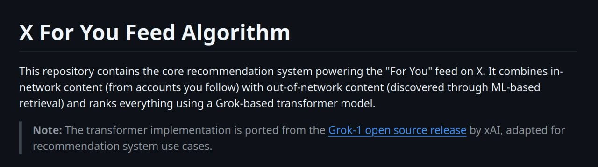

# Image Description

**File:** img_1769168275_aqadqwxrg7sngut_x_for_you_feed_algorithm.jpg
**Original:** image.jpg
**Received:** 1769168275

## Extracted Text (OCR)

## X For You Feed Algorithm

This repository contains the core recommendation system powering the "For You" feed on X. It combines пnetwork content (from accounts you follow) with out-of-network content (discovered through ML-based retrieval) and ranks everything using a Grok-based transformer model.

Note: Tne transformer implementation 15 ported from the Grok-1 open source release by xAl, adapted for recommendation system use cases.

## Usage Instructions

When referencing this image in markdown:
1. Use relative path based on file location
2. Add descriptive alt text based on OCR content above
3. Add text description BELOW the image for GitHub rendering

Example:
```markdown
 <!-- TODO: Broken image path -->

**Image shows:** [Describe what the image contains based on OCR]
```
