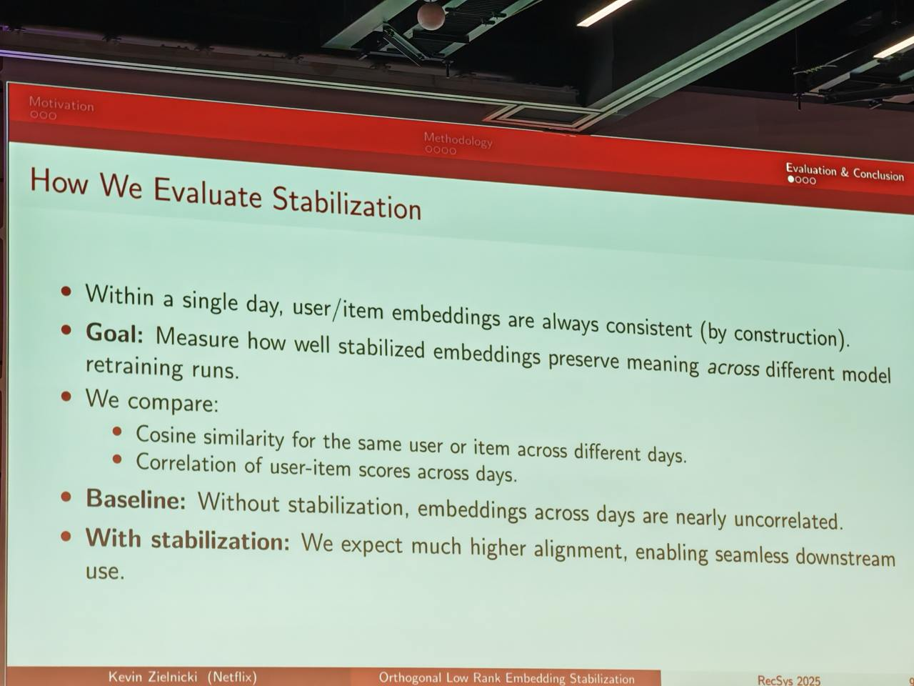

# Image Description

**File:** img_1769168566_aqadcq5rg3zziet_by_construction_retraining_runs.jpg
**Original:** image.jpg
**Received:** 1769168566

## Extracted Text (OCR)

- by construction). retraining runs.
- Correlation of user-item scores across days.
- Baseline: Without stabilization, embeddings
- ‚' With stabilization: We expect much higher alignment, enabling seamless downstream

## Usage Instructions

When referencing this image in markdown:
1. Use relative path based on file location
2. Add descriptive alt text based on OCR content above
3. Add text description BELOW the image for GitHub rendering

Example:
```markdown
 <!-- TODO: Broken image path -->

**Image shows:** [Describe what the image contains based on OCR]
```
