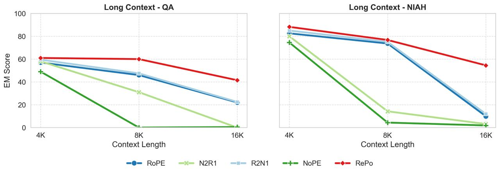

# Image Description

**File:** img_1769170790_aqad4gxrgqwget_100_ak_long_context_qa.jpg
**Original:** image.jpg
**Received:** 1769170790

## Extracted Text (OCR)

100

AK

Long Context - QA

Context Length

Long Context - МАН

Context Length

Re

Po

## Usage Instructions

When referencing this image in markdown:
1. Use relative path based on file location
2. Add descriptive alt text based on OCR content above
3. Add text description BELOW the image for GitHub rendering

Example:
```markdown
 <!-- TODO: Broken image path -->

**Image shows:** [Describe what the image contains based on OCR]
```
