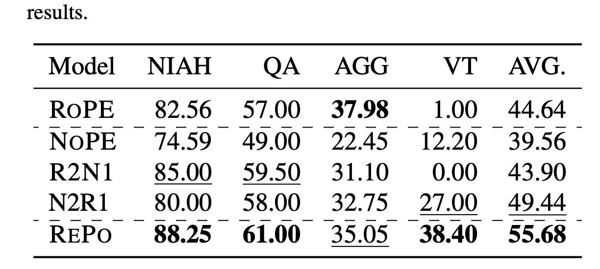

# Image Description

**File:** img_1769172296_aqadcqxrg9d2cut_results_roph_8_56_nope.jpg
**Original:** image.jpg
**Received:** 1769172296

## Extracted Text (OCR)

results.

| ROPH  8) 56 NOPE 7459   |             |
|-------------------------|-------------|
|                         | 77 45 17290 |
| RIN] 3500               |             |
|                         | 3775 27 OOD |

## Usage Instructions

When referencing this image in markdown:
1. Use relative path based on file location
2. Add descriptive alt text based on OCR content above
3. Add text description BELOW the image for GitHub rendering

Example:
```markdown
 <!-- TODO: Broken image path -->

**Image shows:** [Describe what the image contains based on OCR]
```
