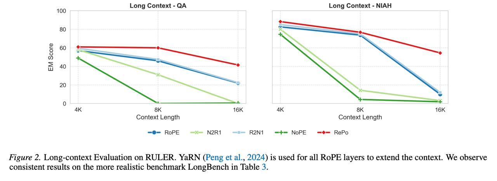

# Image Description

**File:** img_1769172296_aqaddaxrg9d2cut_figure_2_long_context_evaluation_on_rule.jpg
**Original:** image.jpg
**Received:** 1769172296

## Extracted Text (OCR)

Figure 2. Long-context Evaluation on RULER. YaRN (Peng et al., 2024) 1s used for all RoPE layers to extend the context. We observe consistent results on the more realistic benchmark LongBench in lable 3.

<!-- image -->

## Usage Instructions

When referencing this image in markdown:
1. Use relative path based on file location
2. Add descriptive alt text based on OCR content above
3. Add text description BELOW the image for GitHub rendering

Example:
```markdown
 <!-- TODO: Broken image path -->

**Image shows:** [Describe what the image contains based on OCR]
```
