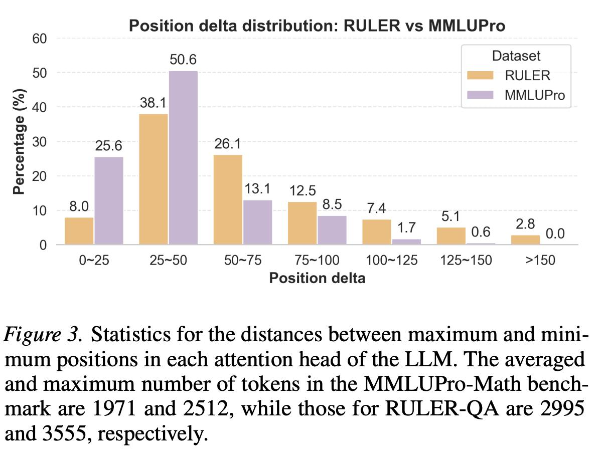

# Image Description

**File:** img_1769172296_aqaddgxrg9d2cut_figure_3_statistics_for_the_distances.jpg
**Original:** image.jpg
**Received:** 1769172296

## Extracted Text (OCR)

Figure 3. Statistics for the distances between maximum and minimum positions ш each attention head of the LLM. The averaged and maximum number of tokens ш the MMLUPro-Math benchmark are 1971 and 2512, while those for RULER-QA are 2995 and 3555, respectively.

<!-- image -->

## Usage Instructions

When referencing this image in markdown:
1. Use relative path based on file location
2. Add descriptive alt text based on OCR content above
3. Add text description BELOW the image for GitHub rendering

Example:
```markdown
 <!-- TODO: Broken image path -->

**Image shows:** [Describe what the image contains based on OCR]
```
