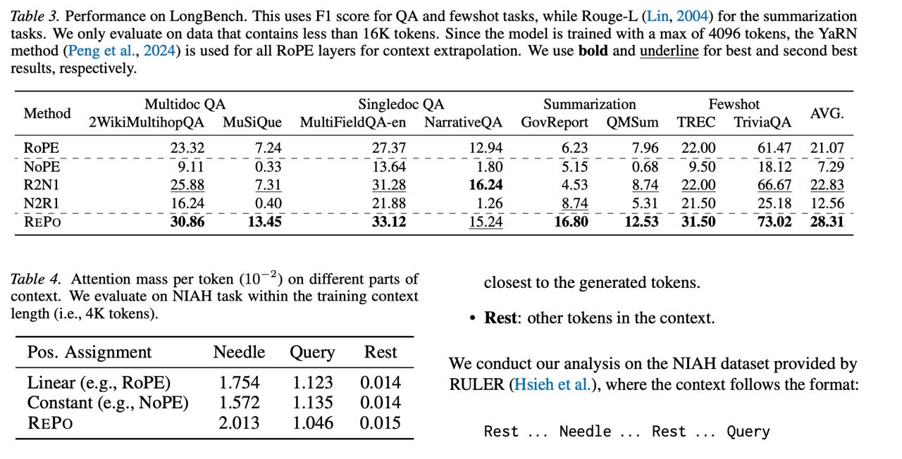

# Image Description

**File:** img_1769172296_aqaddqxrg9d2cut_table_3_performance_on_longbench_this.jpg
**Original:** image.jpg
**Received:** 1769172296

## Extracted Text (OCR)

Table 3. Performance on LongBench. This uses Е] score for QA and fewshot tasks, while Rouge-L (Lin, 2004) for the summarization tasks. We only evaluate on data that contains less than 16K tokens. Since the model ts trained with a max of 4096 tokens, the YaRN method (Peng et al., 2024) 1s used for all RoPE layers for context extrapolation. We use bold and underline for best and second best results, respectively.

| Method ....... MiultidocQA Эра QA Sm marization                                   | Method ....... MiultidocQA Эра QA Sm marization               |
|-----------------------------------------------------------------------------------|---------------------------------------------------------------|
| 2WikiMultihopQA MuSiQue MultiFieldQA-en NarrativeQA GovReport QMSum TREC  TrviaQA |                                                               |
|                                                                                   | R2N1  25.88 $. 31.28 16.24 4.53 8.14 22.00 66.67 22.83  io) — |
| N2RI  16.24  0.40  21.88  1.26  5.31  21.50  25.15  12.56                         |                                                               |
|                                                                                   | REPO  30 86  13 45  3313  15.94  16.80  1253 3150  7302 2831  |

Table 4. Attention mass per token (10° ~) on different parts of context. We evaluate on NIAH task within the training context length (1.e., 4K tokens).

| Pos. Assignment Needle Query ' Rest          |
|----------------------------------------------|
| Linear (e.g., КОРЕ) 1./54 1.125 0.014 RE  Po |
| Constant (e.g., NoPE) 1.572 1.135            |

closest to the generated tokens.

- "„ Rest: other tokens т the context.

We conduct our analysis on the NIAH dataset provided by т.

ОТЕК (Hsieh et al.), where the context follows the format:

Rest ... Needle ... Rest ... Query

## Usage Instructions

When referencing this image in markdown:
1. Use relative path based on file location
2. Add descriptive alt text based on OCR content above
3. Add text description BELOW the image for GitHub rendering

Example:
```markdown
 <!-- TODO: Broken image path -->

**Image shows:** [Describe what the image contains based on OCR]
```
