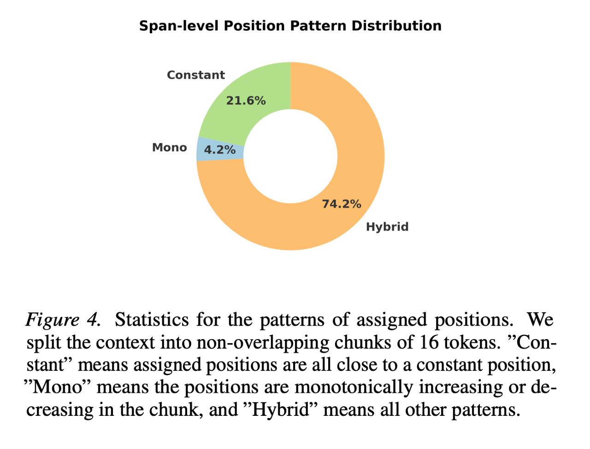

# Image Description

**File:** img_1769172296_aqaddwxrg9d2cut_image_figure_4_statistics.jpg
**Original:** image.jpg
**Received:** 1769172296

## Extracted Text (OCR)

<!-- image -->

Figure 4. Statistics for the patterns of assigned positions. We split the context into non-overlapping chunks of 16 tokens. "Сопstant' means assigned positions are all close to a constant position, Mono" means the positions are monotonically increasing or decreasing in the chunk, and Нуб" means all other patterns.

## Usage Instructions

When referencing this image in markdown:
1. Use relative path based on file location
2. Add descriptive alt text based on OCR content above
3. Add text description BELOW the image for GitHub rendering

Example:
```markdown
 <!-- TODO: Broken image path -->

**Image shows:** [Describe what the image contains based on OCR]
```
