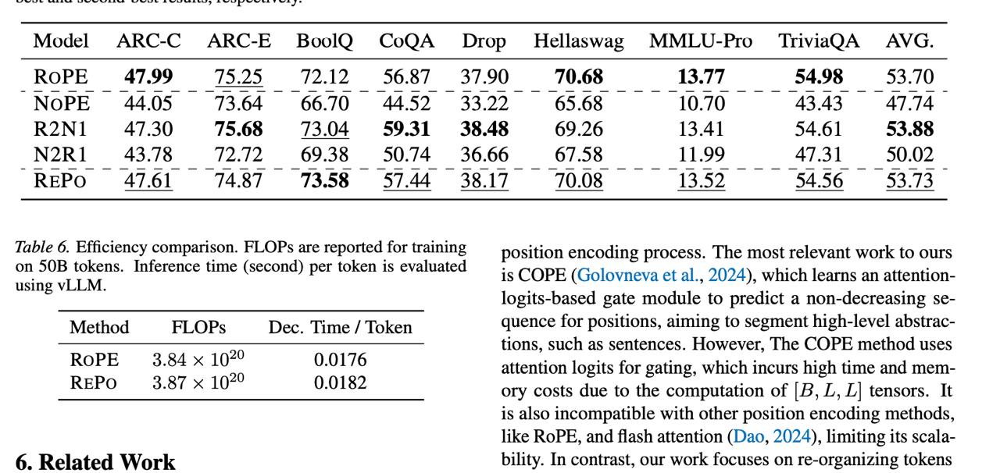

# Image Description

**File:** img_1769172296_aqadeaxrg9d2cut_ee_eee_eee_ee_ee.jpg
**Original:** image.jpg
**Received:** 1769172296

## Extracted Text (OCR)

=
ee, eee eee ee ee ee ee ee

|                                                               | Model ARC-C ARC-E BoolQ CoQA Drop’ Hellaswag MMLU-Pro ТимаОА AVG.   |
|---------------------------------------------------------------|---------------------------------------------------------------------|
|                                                               | ROPE 47.99 75.25 72.12 £356.8/ 37.90 10.68 13.// 54.98 53.70        |
|                                                               | NoPE £44.05 7364 66.70 4452 £33.22 65.68 10.70 43 43 47.74          |
| R2N1 47.30 75.68 $73.04 59.31 38.48 69.26 13.41 54.61 53.88   |                                                                     |
| REPO # £4761 7487 973.58 $157.44 3817 70.0% 1352 54 56 53 73° |                                                                     |

lable 6. Efficiency comparison. FLOPs are reported for training — розноп encoding process. The most relevant work to ours

=a om: )~—(CC

a

оп 208 tokens. Иегепсе tine (second) рег token 15 evalnaien is COPE (Golovneva et al., 2024), which learns an attentionusing VLLM. ОР ООО ООО ИАА
logits-based gate module to predict a non-decreasing seMethod FLOPs Dec. Time / Token quence for positions, aiming to segment high-level abstractions, such as sentences. However, The COPE method uses attention logits for gating, which incurs high time and memory costs due to the computation of |B, L, L| tensors. It is also incompatible with other position encoding methods, like RoPE, and flash attention (Dao, 2024), limiting its scala6. Related Work bility. In contrast, our work focuses on re-organizing tokens ROPE 3.84 x 10" 0.0176 REPO £3.87 1072 0.0182

## Usage Instructions

When referencing this image in markdown:
1. Use relative path based on file location
2. Add descriptive alt text based on OCR content above
3. Add text description BELOW the image for GitHub rendering

Example:
```markdown
 <!-- TODO: Broken image path -->

**Image shows:** [Describe what the image contains based on OCR]
```
