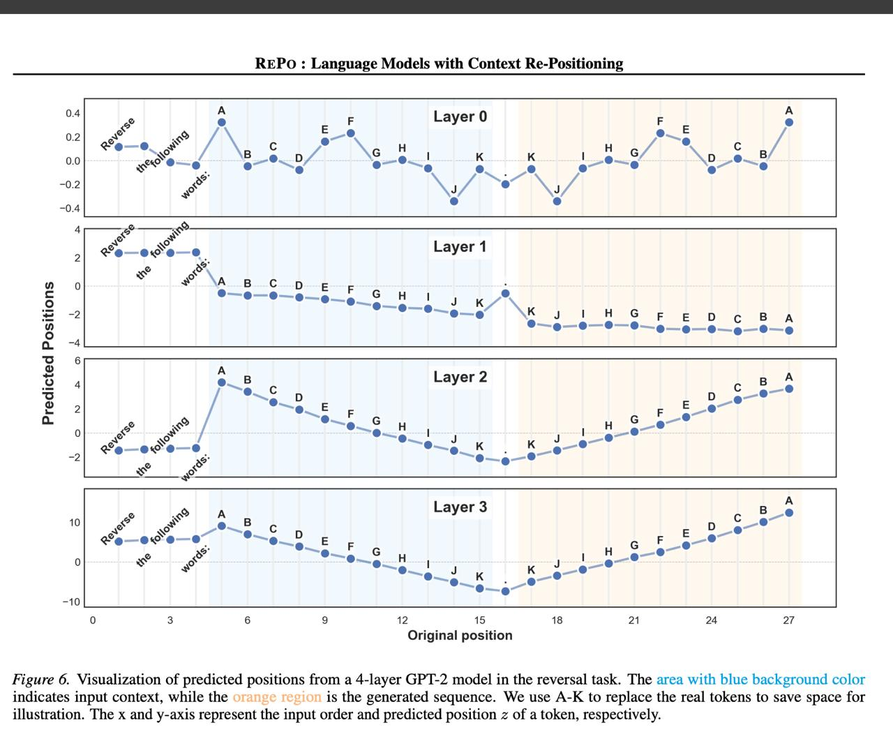

# Image Description

**File:** img_1769172296_aqadeqxrg9d2cut_figure_6_visualization_of_predicted_posi.jpg
**Original:** image.jpg
**Received:** 1769172296

## Extracted Text (OCR)

Figure 6. Visualization of predicted positions from a 4-layer GP I-2 model in the reversal task. [he area with blue background color indicates input context, while the пгс тесная: 1s the generated sequence. We use A-K to replace the real tokens to save space for illustration. [he x and y-axis represent the input order and predicted position z of a token, respectively.

<!-- image -->

## Usage Instructions

When referencing this image in markdown:
1. Use relative path based on file location
2. Add descriptive alt text based on OCR content above
3. Add text description BELOW the image for GitHub rendering

Example:
```markdown
 <!-- TODO: Broken image path -->

**Image shows:** [Describe what the image contains based on OCR]
```
