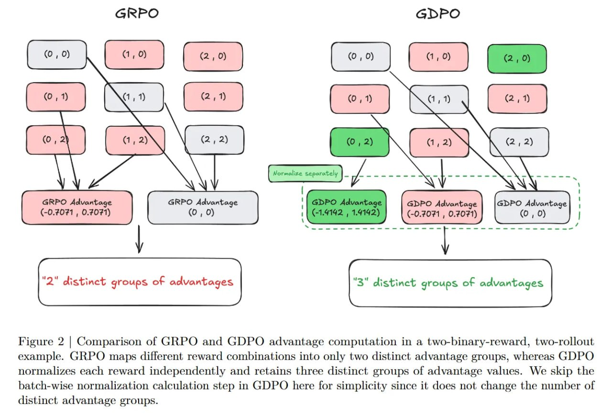

# Image Description

**File:** img_1769229336_aqadihvrg7mrqut_figure_2_comparison_of_grpo.jpg
**Original:** image.jpg
**Received:** 1769229336

## Extracted Text (OCR)

Figure 2 | Comparison of GRPO and GDPO advantage computation in a two-binary-reward, two-rollout example. GRPO maps different reward combinations into only two distinct advantage groups, whereas GDPO normalizes each reward independently and retains three distinct groups of advantage values. We skip the batch-wise normalization calculation step in GDPO here for simplicity since it does not change the number of distinct advantage groups.

<!-- image -->

## Usage Instructions

When referencing this image in markdown:
1. Use relative path based on file location
2. Add descriptive alt text based on OCR content above
3. Add text description BELOW the image for GitHub rendering

Example:
```markdown
 <!-- TODO: Broken image path -->

**Image shows:** [Describe what the image contains based on OCR]
```
