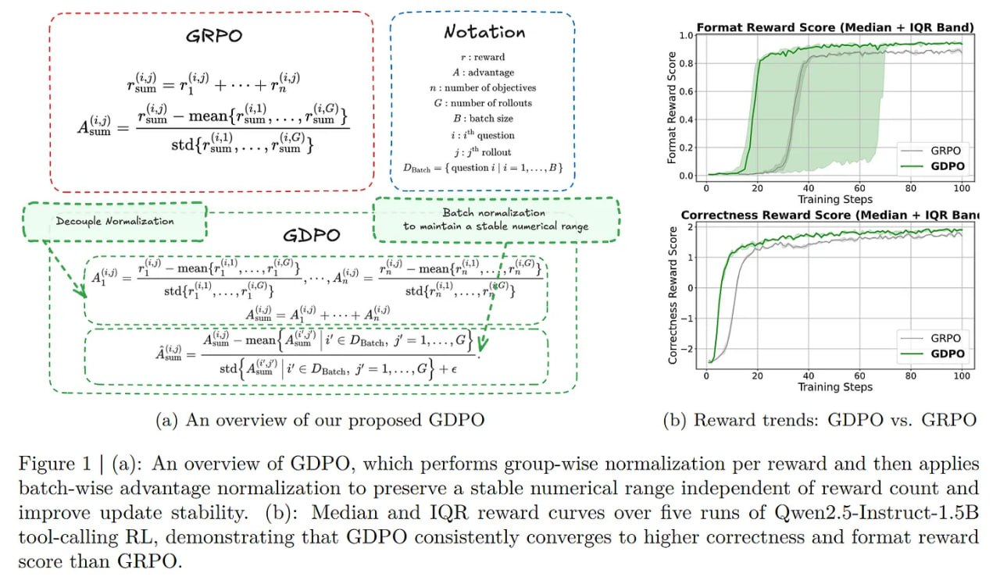

# Image Description

**File:** img_1769229336_aqadixvrg7mrqut_figure_1_a_an_overview.jpg
**Original:** image.jpg
**Received:** 1769229336

## Extracted Text (OCR)

Figure 1 | (a): An overview of GDPO, which performs group-wise normalization per reward and then applies batch-wise advantage normalization to preserve a stable numerical range independent of reward count and improve update stability. (b): Median and IQR reward curves over five runs of Qwen2.5-Instruct-1.5B tool-calling RL, demonstrating that GDPO consistently converges to higher correctness and format reward score than СВРО

<!-- image -->

## Usage Instructions

When referencing this image in markdown:
1. Use relative path based on file location
2. Add descriptive alt text based on OCR content above
3. Add text description BELOW the image for GitHub rendering

Example:
```markdown
 <!-- TODO: Broken image path -->

**Image shows:** [Describe what the image contains based on OCR]
```
