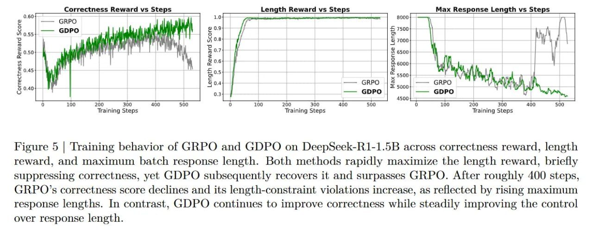

# Image Description

**File:** img_1769229336_aqadjrvrg7mrqut_figure_5_training_behavior_of.jpg
**Original:** image.jpg
**Received:** 1769229336

## Extracted Text (OCR)

Figure 5 | Training behavior of GRPO and GDPO on DeepSeek-R1-1.5B across correctness reward, length reward, and maximum batch response length. Both methods rapidly maximize the length reward, briefly suppressing correctness, yet GDPO subsequently recovers it and surpasses GRPO. After roughly 400 steps. (,RPO's correctness score declines and its length-constraint violations increase, as reflected by rising maximum response lengths. In contrast, GDPO continues to improve correctness while steadily improving the control over response length.

<!-- image -->

## Usage Instructions

When referencing this image in markdown:
1. Use relative path based on file location
2. Add descriptive alt text based on OCR content above
3. Add text description BELOW the image for GitHub rendering

Example:
```markdown
 <!-- TODO: Broken image path -->

**Image shows:** [Describe what the image contains based on OCR]
```
