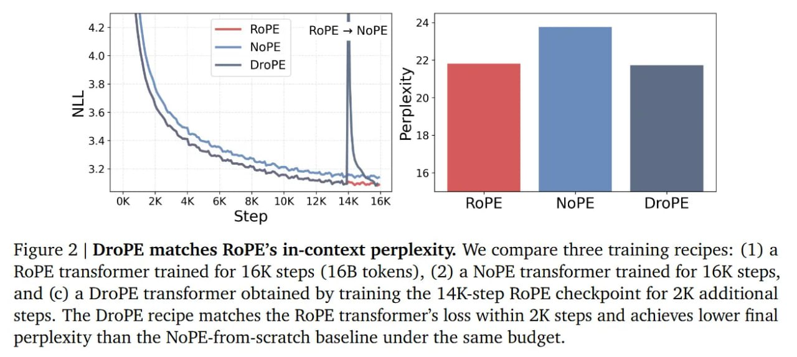

# Image Description

**File:** img_1769229354_aqadabbrg7mrsut_figure_2_drope_matches_rope_s.jpg
**Original:** image.jpg
**Received:** 1769229354

## Extracted Text (OCR)

Figure 2 | DroPE matches RoPE's 1n-context perplexity. We compare three training recipes: (1) a RoPE transformer trained for 16K steps (16B tokens), (2) a NoPE transformer trained for 16K steps, and (c) a DroPE transformer obtained by training the 14K-step RoPE checkpoint for 2K additional steps. The DroPE recipe matches the RoPE transformer's loss within 2K steps and achieves lower final perplexity than the NoPE-from-scratch baseline under the same budget.

<!-- image -->

## Usage Instructions

When referencing this image in markdown:
1. Use relative path based on file location
2. Add descriptive alt text based on OCR content above
3. Add text description BELOW the image for GitHub rendering

Example:
```markdown
 <!-- TODO: Broken image path -->

**Image shows:** [Describe what the image contains based on OCR]
```
