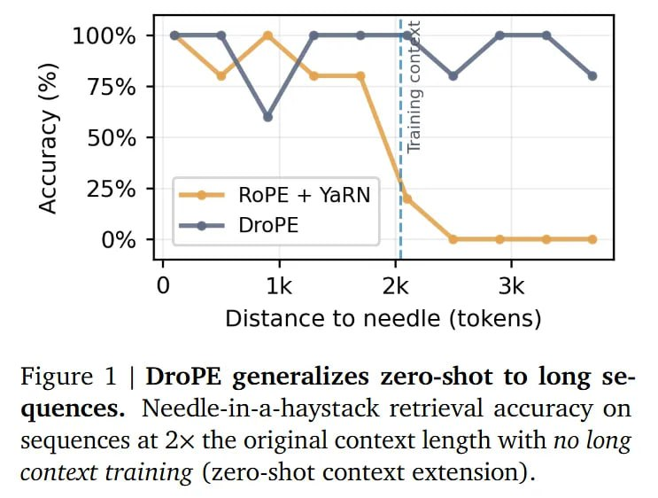

# Image Description

**File:** img_1769229354_aqadahbrg7mrsut9_figure_1_drope_generalizes_zero_shot.jpg
**Original:** image.jpg
**Received:** 1769229354

## Extracted Text (OCR)

Figure 1 | DroPE generalizes zero-shot to long sequences. Needle-in-a-haystack retrieval accuracy on sequences at 2x the original context length with no long context training (zero-shot context extension).

<!-- image -->

## Usage Instructions

When referencing this image in markdown:
1. Use relative path based on file location
2. Add descriptive alt text based on OCR content above
3. Add text description BELOW the image for GitHub rendering

Example:
```markdown
 <!-- TODO: Broken image path -->

**Image shows:** [Describe what the image contains based on OCR]
```
