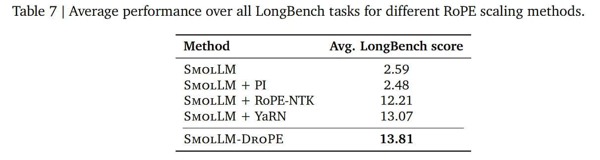

# Image Description

**File:** img_1769229354_aqadbbbrg7mrsut_table_7_average_performance_over.jpg
**Original:** image.jpg
**Received:** 1769229354

## Extracted Text (OCR)

Table 7 | Average performance over all LongBench tasks for different RoPE scaling methods.

| Method Avg. LongBench score                   |
|-----------------------------------------------|
| SMOLLIVI  2.99 SMOLL,  M+  PI SMOLL  М + YaRN |

## Usage Instructions

When referencing this image in markdown:
1. Use relative path based on file location
2. Add descriptive alt text based on OCR content above
3. Add text description BELOW the image for GitHub rendering

Example:
```markdown
 <!-- TODO: Broken image path -->

**Image shows:** [Describe what the image contains based on OCR]
```
