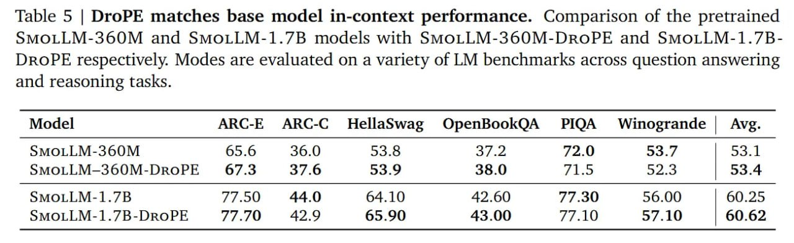

# Image Description

**File:** img_1769229354_aqadbrbrg7mrsut_table_5_drope_matches_base.jpg
**Original:** image.jpg
**Received:** 1769229354

## Extracted Text (OCR)

Table 5 | DroPE matches base model in-context performance. Comparison of the pretrained SMOLLM-3600M and SMOLLM-1.7B models with SMOLLM-3600M-DROPE and SMoLLM-1.7BDROPE respectively. Modes are evaluated on a variety of LM benchmarks across question answering and reasoning tasks.

|                                                                | Model ARC-E ARC-C HellaSwag OpenBookQA PIQA Winogrande | Avg.   |
|----------------------------------------------------------------|-----------------------------------------------------------------|
| SMOLLM-360M  65.6  36.0  53.8  37.                             |                                                                 |
| 376  53.9  38.0  715  57 3                                     |                                                                 |
| SMOLLM-1.7B                                                    |                                                                 |
| SMOLLM-1.7B-DROPE 77.70 49) 9 65.90 413.00 77.10 57.10 | 60.62 |                                                                 |

## Usage Instructions

When referencing this image in markdown:
1. Use relative path based on file location
2. Add descriptive alt text based on OCR content above
3. Add text description BELOW the image for GitHub rendering

Example:
```markdown
 <!-- TODO: Broken image path -->

**Image shows:** [Describe what the image contains based on OCR]
```
