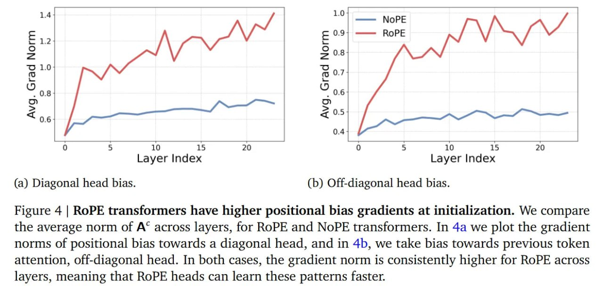

# Image Description

**File:** img_1769229354_aqadzhbrg7mrsut_10_1_41_gad.jpg
**Original:** image.jpg
**Received:** 1769229354

## Extracted Text (OCR)

10:

1.41

gad | = МОРЕ

‚ 0.9] ——— ROPE

10

15

20

o7

10

15

20

<!-- image -->

<!-- image -->

Layer Index Layer Index

(a) Diagonal head bias. (b) Off-diagonal head bias.

Figure 4 | RoPE transformers have higher positional bias gradients at initialization. We compare the average norm of A' across layers, for ROPE and NoPE transformers. In 4a we plot the gradient norms of positional bias towards a diagonal head, and in 4b, we take bias towards previous token attention, off-diagonal head. In both cases, the gradient norm is consistently higher for RoPE across layers, meaning that RoPE heads can learn these patterns faster.

## Usage Instructions

When referencing this image in markdown:
1. Use relative path based on file location
2. Add descriptive alt text based on OCR content above
3. Add text description BELOW the image for GitHub rendering

Example:
```markdown
 <!-- TODO: Broken image path -->

**Image shows:** [Describe what the image contains based on OCR]
```
