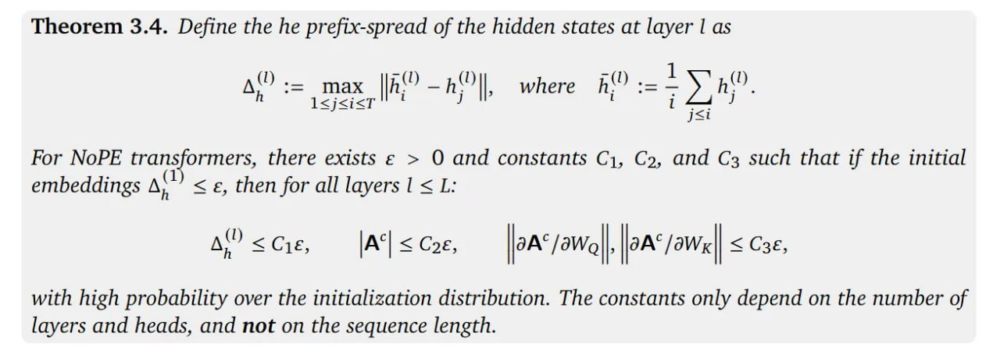

# Image Description

**File:** img_1769229354_aqadzrbrg7mrsut_theorem_3_4_define_the_he_prefix_spread.jpg
**Original:** image.jpg
**Received:** 1769229354

## Extracted Text (OCR)

Theorem 3.4. Define the he prefix-spread of the hidden states at layer | as

<!-- formula-not-decoded -->

For NoPE transformers, there exists е &gt; O and constants Сл, C2, and C3 such that if the initial embeddings д") &lt; =, then for all layers | &lt; L:

<!-- formula-not-decoded -->

with high probability over the initialization distribution. The constants only depend on the number of layers and heads, and not on the sequence length.

## Usage Instructions

When referencing this image in markdown:
1. Use relative path based on file location
2. Add descriptive alt text based on OCR content above
3. Add text description BELOW the image for GitHub rendering

Example:
```markdown
 <!-- TODO: Broken image path -->

**Image shows:** [Describe what the image contains based on OCR]
```
