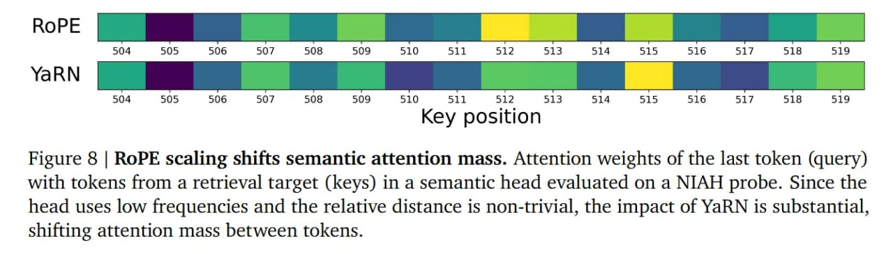

# Image Description

**File:** img_1769229354_aqadzxbrg7mrsut_image_figure_8.jpg
**Original:** image.jpg
**Received:** 1769229354

## Extracted Text (OCR)

<!-- image -->

Figure 8 | RoPE scaling shifts semantic attention mass. Attention weights of the last token (query) with tokens from a retrieval target (keys) in a semantic head evaluated on a NIAH probe. Since the head uses low frequencies and the relative distance is non-trivial, the impact of YaRN is substantial, shifting attention mass between tokens.

## Usage Instructions

When referencing this image in markdown:
1. Use relative path based on file location
2. Add descriptive alt text based on OCR content above
3. Add text description BELOW the image for GitHub rendering

Example:
```markdown
 <!-- TODO: Broken image path -->

**Image shows:** [Describe what the image contains based on OCR]
```
