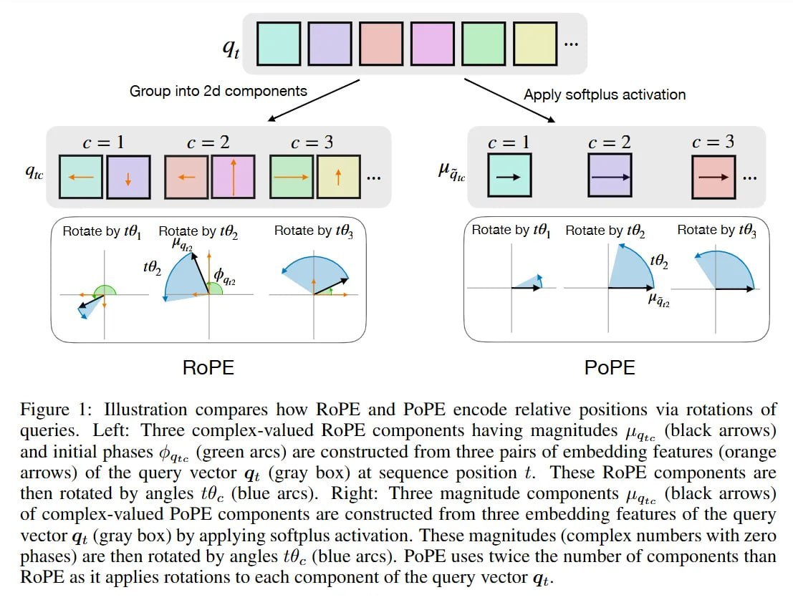

# Image Description

**File:** img_1769229411_aqadmq9rg7dhwut_rigure_iilustration_compares_how_rope.jpg
**Original:** image.jpg
**Received:** 1769229411

## Extracted Text (OCR)

rigure |: Iilustration compares how ROPE and PoPE encode relative positions via rotations of queries. Рей: [hree complex-valued RoPE components having magnitudes jig, (black arrows) and initial phases @,,. (green arcs) are constructed from three pairs of embedding features (orange arrows) of the query vector 4; (gray box) at sequence position 2. Ihese КорРЕ components are then rotated by angles #9. (blue arcs). Right: Three magnitude components +... (black arrows) of complex-valued РоРЕ components are constructed from three embedding features of the query vector а; (gray Dox) by applying softplus activation. [hese magnitudes (complex numbers with zero phases) are then rotated by angles ¢@.. (blue arcs). PoPE uses twice the number of components than ROPE as it applies rotations to each component of the query vector q;.

<!-- image -->

## Usage Instructions

When referencing this image in markdown:
1. Use relative path based on file location
2. Add descriptive alt text based on OCR content above
3. Add text description BELOW the image for GitHub rendering

Example:
```markdown
 <!-- TODO: Broken image path -->

**Image shows:** [Describe what the image contains based on OCR]
```
