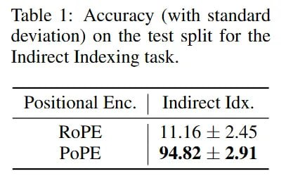

# Image Description

**File:** img_1769229411_aqadmw9rg7dhwut9_lable_accuracy_with_standard_deviation.jpg
**Original:** image.jpg
**Received:** 1769229411

## Extracted Text (OCR)

lable |: Accuracy (with standard deviation) on the test split for the Indirect Indexing task.

Positional Enc.

## Usage Instructions

When referencing this image in markdown:
1. Use relative path based on file location
2. Add descriptive alt text based on OCR content above
3. Add text description BELOW the image for GitHub rendering

Example:
```markdown
 <!-- TODO: Broken image path -->

**Image shows:** [Describe what the image contains based on OCR]
```
