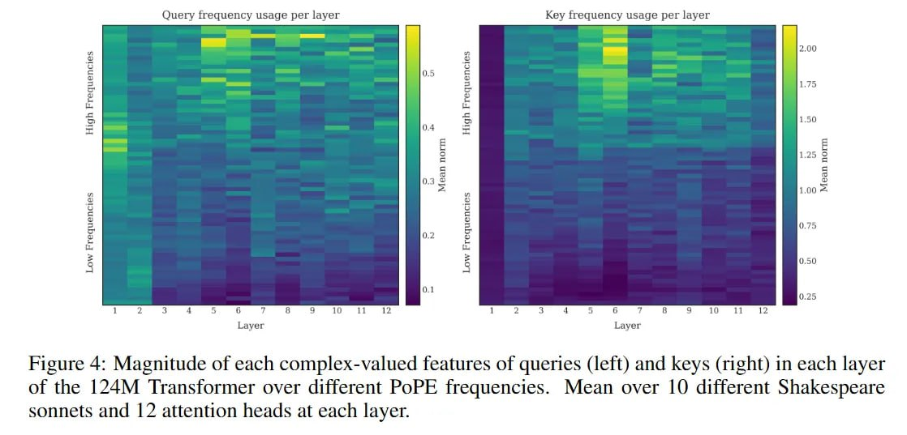

# Image Description

**File:** img_1769229411_aqadng9rg7dhwut_figure_4_magnitude_of_each_complex_value.jpg
**Original:** image.jpg
**Received:** 1769229411

## Extracted Text (OCR)

Figure 4: Magnitude of each complex-valued features of queries (jeft) and keys (right) 1n each layer of the 124M Transformer over different PoPE frequencies. Mean over 10 different Shakespeare sonnets and 1.2 attention heads at each layer.

<!-- image -->

## Usage Instructions

When referencing this image in markdown:
1. Use relative path based on file location
2. Add descriptive alt text based on OCR content above
3. Add text description BELOW the image for GitHub rendering

Example:
```markdown
 <!-- TODO: Broken image path -->

**Image shows:** [Describe what the image contains based on OCR]
```
