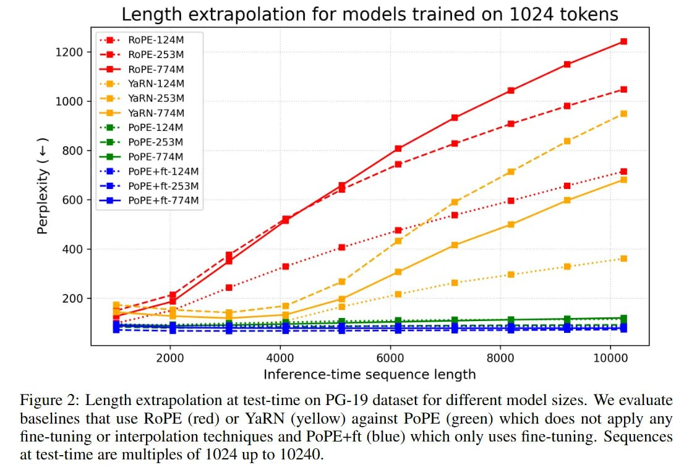

# Image Description

**File:** img_1769229411_aqadnq9rg7dhwut_length_extrapolation_for_models_trained.jpg
**Original:** image.jpg
**Received:** 1769229411

## Extracted Text (OCR)

## Length extrapolation for models trained on 1024 tokens

Figure 2: Length extrapolation at test-time on PG-19 dataset for different model sizes. We evaluate baselines that use ROPE (red) or YaRN (yellow) against РоРЕ (green) which does not apply any fine-tuning or interpolation techniques and PoPE+it (blue) which only uses fine-tuning. Sequences at test-time are multiples of 1024 up to 10240.

<!-- image -->

## Usage Instructions

When referencing this image in markdown:
1. Use relative path based on file location
2. Add descriptive alt text based on OCR content above
3. Add text description BELOW the image for GitHub rendering

Example:
```markdown
 <!-- TODO: Broken image path -->

**Image shows:** [Describe what the image contains based on OCR]
```
