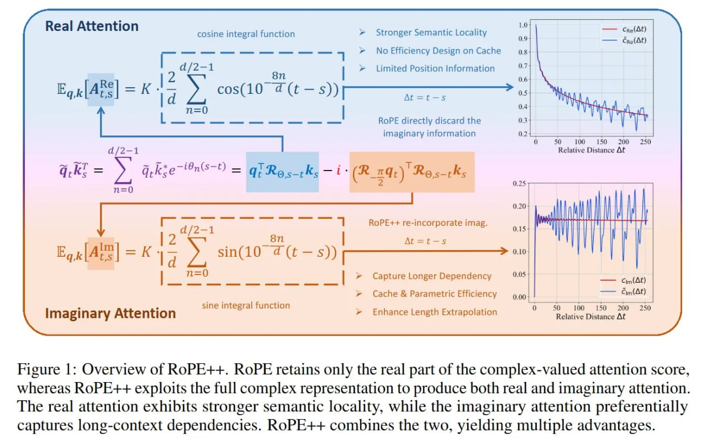

# Image Description

**File:** img_1769229448_aqadubnrg9oryut_figure_1_overview_of_rope_rope.jpg
**Original:** image.jpg
**Received:** 1769229448

## Extracted Text (OCR)

Figure 1: Overview of RoPE++. RoPE retains only the real part of the complex-valued attention score, whereas RoPE++ exploits the full complex representation to produce both real and imaginary attention. The real attention exhibits stronger semantic locality, while the imaginary attention preferentially captures long-context dependencies. RoPE++ combines the two, yielding multiple advantages.

<!-- image -->

## Usage Instructions

When referencing this image in markdown:
1. Use relative path based on file location
2. Add descriptive alt text based on OCR content above
3. Add text description BELOW the image for GitHub rendering

Example:
```markdown
 <!-- TODO: Broken image path -->

**Image shows:** [Describe what the image contains based on OCR]
```
