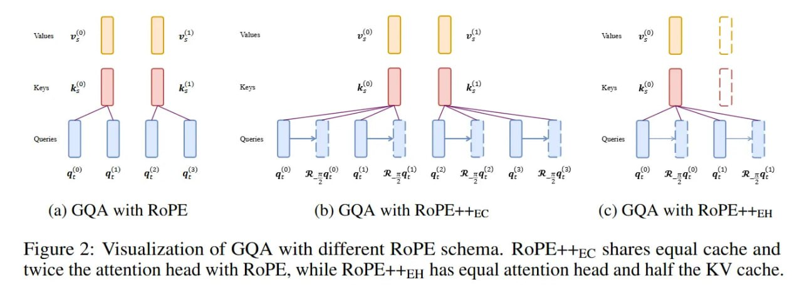

# Image Description

**File:** img_1769229448_aqadvbnrg9oryut_figure_2_visualization_of_with.jpg
**Original:** image.jpg
**Received:** 1769229448

## Extracted Text (OCR)

Figure 2: Visualization of СОА with different RoPE schema. RoPE++.c shares equal cache and twice the attention head with RoPE, while КоРЕ++ЕН has equal attention head and half the KV cache.

<!-- image -->

## Usage Instructions

When referencing this image in markdown:
1. Use relative path based on file location
2. Add descriptive alt text based on OCR content above
3. Add text description BELOW the image for GitHub rendering

Example:
```markdown
 <!-- TODO: Broken image path -->

**Image shows:** [Describe what the image contains based on OCR]
```
