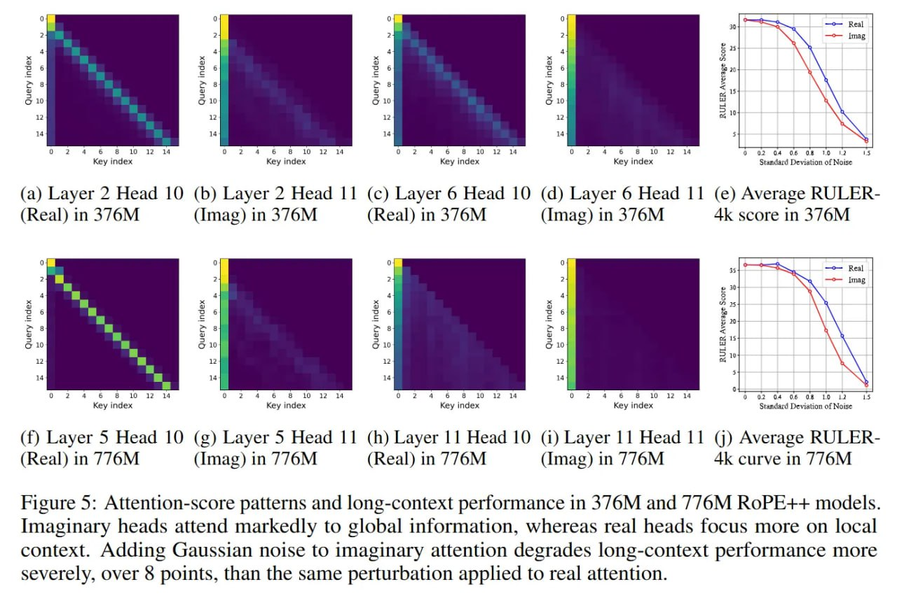

# Image Description

**File:** img_1769229448_aqadvhnrg9oryut_figure_5_attention_score_patterns_and_lo.jpg
**Original:** image.jpg
**Received:** 1769229448

## Extracted Text (OCR)

Figure 5: Attention-score patterns and long-context performance in 376M and 776M RoPE++ models. imaginary heads attend markedly to global information, whereas real heads focus more on |ocal context. Adding Gaussian noise to imaginary attention degrades long-context performance more severely, over 8 points, than the same perturbation applied to real attention.

<!-- image -->

## Usage Instructions

When referencing this image in markdown:
1. Use relative path based on file location
2. Add descriptive alt text based on OCR content above
3. Add text description BELOW the image for GitHub rendering

Example:
```markdown
 <!-- TODO: Broken image path -->

**Image shows:** [Describe what the image contains based on OCR]
```
