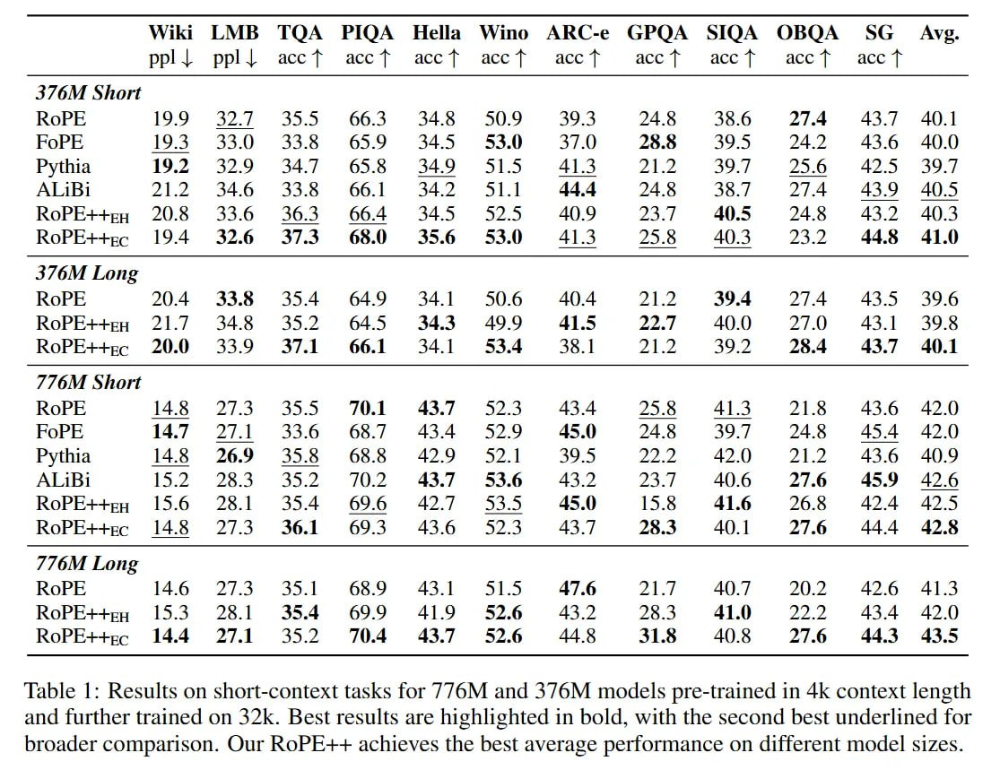

# Image Description

**File:** img_1769229448_aqadvrnrg9oryut_table_1_results_on_short_context_tasks.jpg
**Original:** image.jpg
**Received:** 1769229448

## Extracted Text (OCR)

Table 1: Results on short-context tasks for //6M and 3/6M models pre-trained in 4k context length and further trained on 32k. Best results are highlighted in bold, with the second best underlined for broader comparison. Our ROPE++ achieves the best average performance on different model sizes.

|                                                                          | Wiki LMB TQA PIQA Hella Wino ARC-e GPQA SIQA OBQA SG Avs. рр! + ppll acct acct acct acct acct acef acct ассТ acct   |            |            |            |            |           |           |           |           |           |           |           |
|--------------------------------------------------------------------------|---------------------------------------------------------------------------------------------------------------------|------------|------------|------------|------------|-----------|-----------|-----------|-----------|-----------|-----------|-----------|
| 376M Short                                                               | 376M Short                                                                                                          | 376M Short | 376M Short | 376M Short | 376M Short |           |           |           |           |           |           |           |
| RoPE  19.9 32.7 355 663 348 509 393 24.8 386 27.4 437 = 40.1             |                                                                                                                     |            |            |            |            |           |           |           |           |           |           |           |
| FOPE  9.5 33.0 33.8 059 34.5 559 3/.0 28.8 39D 24.2 435.6 40.0           |                                                                                                                     |            |            |            |            |           |           |           |           |           |           |           |
| Pythia 19.2 329 347 65.8 349 515 SPs] 21.2 39.7 25.6 42.5 39.7           |                                                                                                                     |            |            |            |            |           |           |           |           |           |           |           |
| ALI1B1 21.2 34.6 33.8 66.1 342 51.1 44.4 24.8 38./ 274 439 40.5          |                                                                                                                     |            |            |            |            |           |           |           |           |           |           |           |
| RoPE++eq 20.5  33.6  36.3  66.4  34.5  52.5  4.9  23.1  40.5  24.8       |                                                                                                                     |            |            |            |            |           |           |           |           |           |           |           |
| ROPE++ec 19.4 32.6 327.5 68.0 33.6 5359 41.5 25.8 £40.35  г  32 445 41.0 |                                                                                                                     |            |            |            |            |           |           |           |           |           |           |           |
| 3/6M Long                                                                | 3/6M Long                                                                                                           | 3/6M Long  | 3/6M Long  | 3/6M Long  | 3/6M Long  |           |           |           |           |           |           |           |
| RoPE  a] A                                                               |                                                                                                                     |            |            |            |            |           |           |           |           |           |           |           |
| RoPE++py 21.7  34.8  55.2  64.5  34.3  499  41.5  22.7  400              |                                                                                                                     |            |            |            |            |           |           |           |           |           |           |           |
| RoPE++s- 20.0 33.9 37.1 66.1 ЗАТ 53.4 38. 212 392 284 #£=43.7 = 40.1     |                                                                                                                     |            |            |            |            |           |           |           |           |           |           |           |
| 776M Short                                                               | 776M Short                                                                                                          | 776M Short | 776M Short | 776M Short | 776M Short |           |           |           |           |           |           |           |
| ROPE  14.5 2/.5 355 ДЛЕ 43./ 523 £4354 258 4153 21.8 43.6 42.0           |                                                                                                                     |            |            |            |            |           |           |           |           |           |           |           |
| FOPE  144.71 2/.1 33.6 66./ 434 529 45.0 24.8 39.7 24.8 45.4 42.0        |                                                                                                                     |            |            |            |            |           |           |           |           |           |           |           |
| Pythia 148 26.9 35.8 68.8 42.9 52.1 39.5 22.2 42.0 21.2 43.6 40.9        |                                                                                                                     |            |            |            |            |           |           |           |           |           |           |           |
| ALj1B1 15.2 26.5 335.2 Д.22 43./ 33.6 43.2 25./ 40.6 27.6 435.9 42.6     |                                                                                                                     |            |            |            |            |           |           |           |           |           |           |           |
| КоРЕ-++ен 15.6 28.1 354 69.6 42.7 535 45.9 15.8 41.6 26.8 424 42.5       |                                                                                                                     |            |            |            |            |           |           |           |           |           |           |           |
| RoPE++rc 145 27/3 36.1 69.5 436 52.35 453: 25.5 401] 2/.6                |                                                                                                                     |            |            |            |            |           |           |           |           |           |           |           |
| //6M Long                                                                | //6M Long                                                                                                           | //6M Long  | //6M Long  | //6M Long  | //6M Long  | //6M Long | //6M Long | //6M Long | //6M Long | //6M Long | //6M Long | //6M Long |
| RoPE++eu 15.3 28.1 35.4 699 419 52.6 437 283 41.0 227 434 420            |                                                                                                                     |            |            |            |            |           |           |           |           |           |           |           |
| RoPE++e- 14.4 27.1 352 70.4 43.7 52.6 445 31.8 408  £=27.6 443 435       |                                                                                                                     |            |            |            |            |           |           |           |           |           |           |           |

## Usage Instructions

When referencing this image in markdown:
1. Use relative path based on file location
2. Add descriptive alt text based on OCR content above
3. Add text description BELOW the image for GitHub rendering

Example:
```markdown
 <!-- TODO: Broken image path -->

**Image shows:** [Describe what the image contains based on OCR]
```
